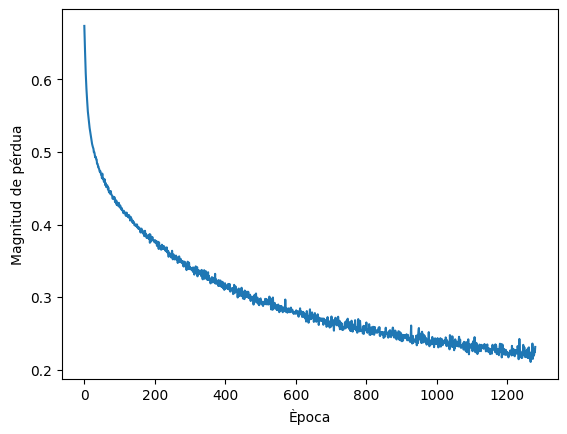
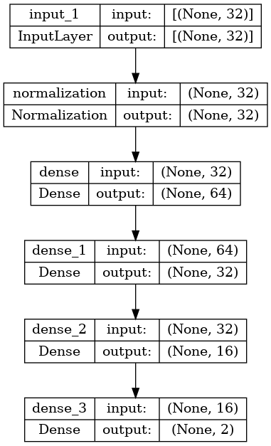
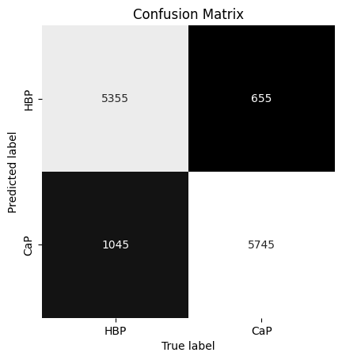
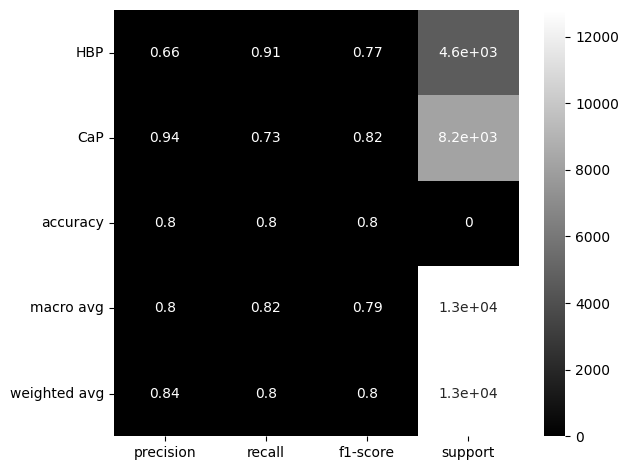

```python
#imports aquí 
import sys
# insert at 1, 0 is the script path (or '' in REPL)
sys.path.insert(1, '/home/talens/ml4bda/')
import caixaBigot as cb
import numpy as np
import pandas as pd
import matplotlib.pyplot as plt
import sys
import subprocess
import time
import scipy
import seaborn as sns
import h5py
from pandas import DataFrame
from pandas import Series
from pandas import HDFStore,DataFrame
from pandas import Series
import re
import listArxiu
import arreglaCurva
from sklearn import preprocessing
from sklearn.preprocessing import Normalizer
from scipy import signal
import pickle as pl #http://fredborg-braedstrup.dk/blog/2014/10/10/saving-mpl-figures-using-pickle/
import os
import representar
import glob
import shutil
import COVs
import correctorMoosy32
import contarTipus
from engineering_notation import EngNumber#pip3 install engineering_notation
import arff
from TGS import TGS
import param2dfX2 as param
import pandas as pd
from dfX2h5 import *
import os
import sys
import tensorflow as tf
import torch #afegir a la documentacio
```

    2022-11-27 09:57:43.529763: I tensorflow/core/platform/cpu_feature_guard.cc:193] This TensorFlow binary is optimized with oneAPI Deep Neural Network Library (oneDNN) to use the following CPU instructions in performance-critical operations:  AVX2 FMA
    To enable them in other operations, rebuild TensorFlow with the appropriate compiler flags.
    2022-11-27 09:57:43.699741: W tensorflow/stream_executor/platform/default/dso_loader.cc:64] Could not load dynamic library 'libcudart.so.11.0'; dlerror: libcudart.so.11.0: cannot open shared object file: No such file or directory
    2022-11-27 09:57:43.699781: I tensorflow/stream_executor/cuda/cudart_stub.cc:29] Ignore above cudart dlerror if you do not have a GPU set up on your machine.
    2022-11-27 09:57:43.731496: E tensorflow/stream_executor/cuda/cuda_blas.cc:2981] Unable to register cuBLAS factory: Attempting to register factory for plugin cuBLAS when one has already been registered
    2022-11-27 09:57:44.485003: W tensorflow/stream_executor/platform/default/dso_loader.cc:64] Could not load dynamic library 'libnvinfer.so.7'; dlerror: libnvinfer.so.7: cannot open shared object file: No such file or directory
    2022-11-27 09:57:44.485157: W tensorflow/stream_executor/platform/default/dso_loader.cc:64] Could not load dynamic library 'libnvinfer_plugin.so.7'; dlerror: libnvinfer_plugin.so.7: cannot open shared object file: No such file or directory
    2022-11-27 09:57:44.485168: W tensorflow/compiler/tf2tensorrt/utils/py_utils.cc:38] TF-TRT Warning: Cannot dlopen some TensorRT libraries. If you would like to use Nvidia GPU with TensorRT, please make sure the missing libraries mentioned above are installed properly.


```python
'''Anem a carregar el dataframe de train en memòria'''
directory = './salida/'
hdf_dirname =directory+'CaP-PBH-40-train.h5'
df1=pd.read_hdf(hdf_dirname, '/df1')
#df1.head
df1.sample(frac=1)
```


<div>
<style scoped>
    .dataframe tbody tr th:only-of-type {
        vertical-align: middle;
    }

    .dataframe tbody tr th {
        vertical-align: top;
    }

    .dataframe thead th {
        text-align: right;
    }
</style>
<table border="1" class="dataframe">
  <thead>
    <tr style="text-align: right;">
      <th></th>
      <th>Sensor</th>
      <th>el75</th>
      <th>std</th>
      <th>moda</th>
      <th>media</th>
      <th>mediana</th>
      <th>iqr</th>
      <th>cv</th>
      <th>V40</th>
      <th>V60</th>
      <th>...</th>
      <th>asimetria</th>
      <th>Met</th>
      <th>IsoB</th>
      <th>Prop</th>
      <th>Hidro</th>
      <th>Etan</th>
      <th>CO</th>
      <th>Air</th>
      <th>class</th>
      <th>target</th>
    </tr>
  </thead>
  <tbody>
    <tr>
      <th>15</th>
      <td>S16-TGS2600</td>
      <td>0.069987</td>
      <td>0.029310</td>
      <td>0.074030</td>
      <td>0.044243</td>
      <td>0.048863</td>
      <td>0.051727</td>
      <td>66.247576</td>
      <td>0.023413</td>
      <td>0.055397</td>
      <td>...</td>
      <td>-0.363652</td>
      <td>5.988965e-07</td>
      <td>5.155953e-03</td>
      <td>0.0</td>
      <td>0.009033</td>
      <td>0.005003</td>
      <td>0.004172</td>
      <td>0.0</td>
      <td>0</td>
      <td>0</td>
    </tr>
    <tr>
      <th>4</th>
      <td>S5-TGS2611-e00</td>
      <td>0.020838</td>
      <td>0.009284</td>
      <td>0.025442</td>
      <td>0.012499</td>
      <td>0.014065</td>
      <td>0.018787</td>
      <td>74.278332</td>
      <td>0.016666</td>
      <td>0.021595</td>
      <td>...</td>
      <td>-0.144826</td>
      <td>6.306314e+01</td>
      <td>1.048389e+19</td>
      <td>0.0</td>
      <td>128.694173</td>
      <td>0.000000</td>
      <td>0.000000</td>
      <td>0.0</td>
      <td>1</td>
      <td>1</td>
    </tr>
    <tr>
      <th>18</th>
      <td>S19-TGS2620</td>
      <td>0.222162</td>
      <td>0.097502</td>
      <td>0.264728</td>
      <td>0.119466</td>
      <td>0.101053</td>
      <td>0.200295</td>
      <td>81.614394</td>
      <td>0.182282</td>
      <td>0.237813</td>
      <td>...</td>
      <td>0.161825</td>
      <td>4.714384e+02</td>
      <td>1.864301e+01</td>
      <td>0.0</td>
      <td>9.902445</td>
      <td>17.771747</td>
      <td>45.883859</td>
      <td>0.0</td>
      <td>1</td>
      <td>1</td>
    </tr>
    <tr>
      <th>15</th>
      <td>S16-TGS2600</td>
      <td>0.045174</td>
      <td>0.021935</td>
      <td>0.056814</td>
      <td>0.025159</td>
      <td>0.020945</td>
      <td>0.040613</td>
      <td>87.185300</td>
      <td>0.015003</td>
      <td>0.039756</td>
      <td>...</td>
      <td>0.335172</td>
      <td>4.309245e-07</td>
      <td>4.681615e-03</td>
      <td>0.0</td>
      <td>0.008313</td>
      <td>0.004558</td>
      <td>0.003660</td>
      <td>0.0</td>
      <td>0</td>
      <td>0</td>
    </tr>
    <tr>
      <th>0</th>
      <td>S1-TGS2611-c00</td>
      <td>0.004399</td>
      <td>0.002099</td>
      <td>0.005785</td>
      <td>0.002425</td>
      <td>0.002014</td>
      <td>0.004053</td>
      <td>86.559866</td>
      <td>0.002240</td>
      <td>0.004570</td>
      <td>...</td>
      <td>0.268531</td>
      <td>6.726941e+01</td>
      <td>1.000000e+00</td>
      <td>0.0</td>
      <td>177.570626</td>
      <td>312.462373</td>
      <td>0.000000</td>
      <td>0.0</td>
      <td>0</td>
      <td>0</td>
    </tr>
    <tr>
      <th>...</th>
      <td>...</td>
      <td>...</td>
      <td>...</td>
      <td>...</td>
      <td>...</td>
      <td>...</td>
      <td>...</td>
      <td>...</td>
      <td>...</td>
      <td>...</td>
      <td>...</td>
      <td>...</td>
      <td>...</td>
      <td>...</td>
      <td>...</td>
      <td>...</td>
      <td>...</td>
      <td>...</td>
      <td>...</td>
      <td>...</td>
      <td>...</td>
    </tr>
    <tr>
      <th>6</th>
      <td>S7-TGS2620</td>
      <td>0.147630</td>
      <td>0.065071</td>
      <td>0.181713</td>
      <td>0.082920</td>
      <td>0.071709</td>
      <td>0.127951</td>
      <td>78.474766</td>
      <td>0.110663</td>
      <td>0.155800</td>
      <td>...</td>
      <td>0.162594</td>
      <td>4.334706e+02</td>
      <td>1.747615e+01</td>
      <td>0.0</td>
      <td>9.262500</td>
      <td>16.828114</td>
      <td>43.061054</td>
      <td>0.0</td>
      <td>0</td>
      <td>0</td>
    </tr>
    <tr>
      <th>2</th>
      <td>S3-TGS2620</td>
      <td>0.182322</td>
      <td>0.081201</td>
      <td>0.223403</td>
      <td>0.098868</td>
      <td>0.081921</td>
      <td>0.164336</td>
      <td>82.130376</td>
      <td>0.146672</td>
      <td>0.198771</td>
      <td>...</td>
      <td>0.202750</td>
      <td>4.524234e+02</td>
      <td>1.806144e+01</td>
      <td>0.0</td>
      <td>9.583321</td>
      <td>17.302626</td>
      <td>44.477367</td>
      <td>0.0</td>
      <td>0</td>
      <td>0</td>
    </tr>
    <tr>
      <th>19</th>
      <td>S20-TGS2611-c00</td>
      <td>0.263771</td>
      <td>0.115358</td>
      <td>0.322429</td>
      <td>0.146994</td>
      <td>0.126640</td>
      <td>0.229443</td>
      <td>78.477814</td>
      <td>0.217865</td>
      <td>0.282765</td>
      <td>...</td>
      <td>0.155907</td>
      <td>1.452673e+02</td>
      <td>1.000000e+00</td>
      <td>0.0</td>
      <td>443.802121</td>
      <td>754.387077</td>
      <td>0.000000</td>
      <td>0.0</td>
      <td>1</td>
      <td>1</td>
    </tr>
    <tr>
      <th>3</th>
      <td>S4-TGS2611-c00</td>
      <td>0.118678</td>
      <td>0.051331</td>
      <td>0.146182</td>
      <td>0.068148</td>
      <td>0.060747</td>
      <td>0.100195</td>
      <td>75.323720</td>
      <td>0.099419</td>
      <td>0.126834</td>
      <td>...</td>
      <td>0.120058</td>
      <td>1.218764e+02</td>
      <td>1.000000e+00</td>
      <td>0.0</td>
      <td>360.136529</td>
      <td>617.017865</td>
      <td>0.000000</td>
      <td>0.0</td>
      <td>1</td>
      <td>1</td>
    </tr>
    <tr>
      <th>4</th>
      <td>S5-TGS2611-e00</td>
      <td>0.011217</td>
      <td>0.006039</td>
      <td>0.015991</td>
      <td>0.005477</td>
      <td>0.001887</td>
      <td>0.010806</td>
      <td>110.259618</td>
      <td>0.001889</td>
      <td>0.011105</td>
      <td>...</td>
      <td>0.704219</td>
      <td>5.611541e+01</td>
      <td>8.675108e+16</td>
      <td>0.0</td>
      <td>111.152459</td>
      <td>0.000000</td>
      <td>0.000000</td>
      <td>0.0</td>
      <td>1</td>
      <td>1</td>
    </tr>
  </tbody>
</table>
<p>12800 rows × 34 columns</p>
</div>


```python
'''Canvie el tipus a float32 per si de cas'''
df1[df1.select_dtypes(np.float64).columns] = df1.select_dtypes(np.float64).astype(np.float32)
df1[df1.select_dtypes(np.int64).columns] = df1.select_dtypes(np.int64).astype(np.float32)
df1.dtypes
```


    Sensor        object
    el75         float32
    std          float32
    moda         float32
    media        float32
    mediana      float32
    iqr          float32
    cv           float32
    V40          float32
    V60          float32
    Vmax         float32
    V100         float32
    V120         float32
    difBA        float32
    difBC        float32
    difBD        float32
    difBE        float32
    slopeAB      float32
    slopeBC      float32
    slopeAD      float32
    slopeDE      float32
    slopeEC      float32
    slopeBE      float32
    slopeDB      float32
    asimetria    float32
    Met          float32
    IsoB         float32
    Prop         float32
    Hidro        float32
    Etan         float32
    CO           float32
    Air          float32
    class        float32
    target       float32
    dtype: object


```python
#df1.isnull().sum().sum()
df1.fillna(0.0)
df1.replace([np.inf, -np.inf], np.nan, inplace=True)
#df1.replace(np.nan, 0)


```


```python
df1.isnull().sum().sum()
```


    829


```python
'''Per tal de canviar de text a números '''
sensor_mapping={label:idx for idx, label in
               enumerate (np.unique(df1['Sensor']))} 
sensor_mapping

df1['Sensor']=df1['Sensor'].map(sensor_mapping) #canvia el valor
```


```python
'''Per tal de revertir el número a text'''
#inv_sensor_mapping = {v: k for k, v in sensor_mapping.items()}
# df1['Sensor']= df1['Sensor'].map(inv_class_mapping) 
```


    'Per tal de revertir el número a text'


```python
#target = df1.iloc[0:,32:34].values
#print('Class labels:', np.unique(target))
#target.shape
```


```python
target = df1.pop('target')
#target.head()
#print('Class labels:', np.unique(target))
```


```python
numeric_feature_names = ['Sensor',
                         'el75',
                         'std',
                         'moda',
                         'media',
                         'mediana',
                         'iqr',
                         'cv',
                         'V40',
                         'V60',
                         'Vmax',
                         'V100',
                         'V120',
                         'difBA',
                         'difBC',
                         'difBD',
                         'difBE',
                         'slopeAB',
                         'slopeBC',
                         'slopeAD',
                         'slopeDE',
                         'slopeEC',
                         'slopeBE',
                         'slopeDB',
                         'asimetria',
                         'Met',
                         'IsoB',
                         'Prop',
                         'Hidro',
                         'Etan',
                         'CO',
                         'Air',
                        ]
numeric_features = df1[numeric_feature_names]
numeric_features.head()

```


<div>
<style scoped>
    .dataframe tbody tr th:only-of-type {
        vertical-align: middle;
    }

    .dataframe tbody tr th {
        vertical-align: top;
    }

    .dataframe thead th {
        text-align: right;
    }
</style>
<table border="1" class="dataframe">
  <thead>
    <tr style="text-align: right;">
      <th></th>
      <th>Sensor</th>
      <th>el75</th>
      <th>std</th>
      <th>moda</th>
      <th>media</th>
      <th>mediana</th>
      <th>iqr</th>
      <th>cv</th>
      <th>V40</th>
      <th>V60</th>
      <th>...</th>
      <th>slopeBE</th>
      <th>slopeDB</th>
      <th>asimetria</th>
      <th>Met</th>
      <th>IsoB</th>
      <th>Prop</th>
      <th>Hidro</th>
      <th>Etan</th>
      <th>CO</th>
      <th>Air</th>
    </tr>
  </thead>
  <tbody>
    <tr>
      <th>0</th>
      <td>0</td>
      <td>0.003686</td>
      <td>0.001450</td>
      <td>0.004288</td>
      <td>0.002404</td>
      <td>0.002489</td>
      <td>0.002410</td>
      <td>60.334152</td>
      <td>0.001459</td>
      <td>0.003232</td>
      <td>...</td>
      <td>-0.000043</td>
      <td>0.000053</td>
      <td>-0.159998</td>
      <td>6.542502e+01</td>
      <td>1.000000e+00</td>
      <td>0.0</td>
      <td>171.792999</td>
      <td>302.673584</td>
      <td>0.000000</td>
      <td>0.0</td>
    </tr>
    <tr>
      <th>1</th>
      <td>11</td>
      <td>0.015796</td>
      <td>0.008602</td>
      <td>0.022377</td>
      <td>0.009319</td>
      <td>0.006354</td>
      <td>0.013158</td>
      <td>92.301987</td>
      <td>0.004017</td>
      <td>0.012348</td>
      <td>...</td>
      <td>-0.000545</td>
      <td>0.000547</td>
      <td>0.719136</td>
      <td>2.055548e-07</td>
      <td>3.768247e-03</td>
      <td>0.0</td>
      <td>0.006898</td>
      <td>0.003698</td>
      <td>0.002726</td>
      <td>0.0</td>
    </tr>
    <tr>
      <th>2</th>
      <td>22</td>
      <td>0.049925</td>
      <td>0.021870</td>
      <td>0.062636</td>
      <td>0.029701</td>
      <td>0.027040</td>
      <td>0.037673</td>
      <td>73.633072</td>
      <td>0.027291</td>
      <td>0.050004</td>
      <td>...</td>
      <td>-0.000976</td>
      <td>0.000689</td>
      <td>0.113840</td>
      <td>3.533174e+02</td>
      <td>1.493114e+01</td>
      <td>0.0</td>
      <td>7.871860</td>
      <td>14.734585</td>
      <td>36.892464</td>
      <td>0.0</td>
    </tr>
    <tr>
      <th>3</th>
      <td>26</td>
      <td>0.014490</td>
      <td>0.006116</td>
      <td>0.017908</td>
      <td>0.008826</td>
      <td>0.008261</td>
      <td>0.010453</td>
      <td>69.294838</td>
      <td>0.008389</td>
      <td>0.014617</td>
      <td>...</td>
      <td>-0.000259</td>
      <td>0.000180</td>
      <td>0.036221</td>
      <td>8.190455e+01</td>
      <td>1.000000e+00</td>
      <td>0.0</td>
      <td>224.434525</td>
      <td>391.449127</td>
      <td>0.000000</td>
      <td>0.0</td>
    </tr>
    <tr>
      <th>4</th>
      <td>27</td>
      <td>0.004684</td>
      <td>0.002020</td>
      <td>0.005858</td>
      <td>0.002793</td>
      <td>0.002583</td>
      <td>0.003706</td>
      <td>72.325844</td>
      <td>0.002845</td>
      <td>0.004770</td>
      <td>...</td>
      <td>-0.000089</td>
      <td>0.000060</td>
      <td>0.121335</td>
      <td>4.802394e+01</td>
      <td>1.447402e+14</td>
      <td>0.0</td>
      <td>91.416496</td>
      <td>0.000000</td>
      <td>0.000000</td>
      <td>0.0</td>
    </tr>
  </tbody>
</table>
<p>5 rows × 32 columns</p>
</div>


```python
'''Per a Normalitzar les dades per files'''
#numeric_features=numeric_features.div(numeric_features.sum(axis=1), axis=0)
#numeric_features.head()
#numeric_features.max()
```


    'Per a Normalitzar les dades per files'


```python

```


```python
'''Convertir el Dataframe en tensor'''
#from sklearn.preprocessing import StandardScaler
#scaler = StandardScaler()
#scaler.fit(numeric_features)
tensor_train=tf.convert_to_tensor(numeric_features)
tensor_target=tf.convert_to_tensor(target)
def replacenan(t):
    return tf.where(tf.math.is_nan(t), tf.zeros_like(t), t)
tensor_train = replacenan(tensor_train)
tensor_target=replacenan(tensor_target)
#un warning amb la cpu si no tens gpu https://stackoverflow.com/questions/59499764/tensorflow-not-tensorflow-gpu-failed-call-to-cuinit-unknown-error-303
#tf.convert_to_tensor(target)

#numeric_dict_ds = tf.data.Dataset.from_tensor_slices((dict(numeric_features), target))
#for row in numeric_dict_ds.take(3):
#  print(row)
print(tensor_train)
```

    tf.Tensor(
    [[0.00000000e+00 3.68634262e-03 1.45034480e-03 ... 3.02673584e+02
      0.00000000e+00 0.00000000e+00]
     [1.10000000e+01 1.57958083e-02 8.60165339e-03 ... 3.69828404e-03
      2.72589596e-03 0.00000000e+00]
     [2.20000000e+01 4.99251634e-02 2.18698382e-02 ... 1.47345848e+01
      3.68924637e+01 0.00000000e+00]
     ...
     [2.30000000e+01 9.52446461e-02 4.25203294e-02 ... 1.59189215e+01
      4.03656807e+01 0.00000000e+00]
     [2.40000000e+01 8.37306008e-02 3.74861844e-02 ... 1.56689968e+01
      3.96291084e+01 0.00000000e+00]
     [2.50000000e+01 7.69510493e-02 3.46375629e-02 ... 5.10707404e-03
      4.29488625e-03 0.00000000e+00]], shape=(12800, 32), dtype=float64)


    2022-11-27 09:58:02.726060: W tensorflow/stream_executor/platform/default/dso_loader.cc:64] Could not load dynamic library 'libcuda.so.1'; dlerror: libcuda.so.1: cannot open shared object file: No such file or directory
    2022-11-27 09:58:02.726114: W tensorflow/stream_executor/cuda/cuda_driver.cc:263] failed call to cuInit: UNKNOWN ERROR (303)
    2022-11-27 09:58:02.726140: I tensorflow/stream_executor/cuda/cuda_diagnostics.cc:156] kernel driver does not appear to be running on this host (talens): /proc/driver/nvidia/version does not exist
    2022-11-27 09:58:02.726742: I tensorflow/core/platform/cpu_feature_guard.cc:193] This TensorFlow binary is optimized with oneAPI Deep Neural Network Library (oneDNN) to use the following CPU instructions in performance-critical operations:  AVX2 FMA
    To enable them in other operations, rebuild TensorFlow with the appropriate compiler flags.


```python
'''def stack_dict(inputs, fun=tf.stack):
    values = []
    for key in sorted(inputs.keys()):
      values.append(tf.cast(inputs[key], tf.float32))

    return fun(values, axis=-1)'''

'''numeric_dataset = tf.data.Dataset.from_tensor_slices((numeric_features, target))

for row in numeric_dataset.take(3):
  print(row)
'''

```


    'numeric_dataset = tf.data.Dataset.from_tensor_slices((numeric_features, target))\n\nfor row in numeric_dataset.take(3):\n  print(row)\n'


```python
#model.fit(dict(numeric_features), target, epochs=5, batch_size=BATCH_SIZE)

numeric_features.shape
```


    (12800, 32)


```python
'''Normalitzar les dades per a que tots els inputs sumen 1 creem el normalitzador'''
normalizer = tf.keras.layers.Normalization(axis=-1)
normalizer.adapt(tensor_train) 
#norm_x = normalizer(numeric_features.replace(np.nan,0))
#print(tf.reduce_mean(norm_x), tf.math.reduce_std(norm_x))
#print(norm_x)
```


```python
target.shape
```


    (12800,)


```python
def get_basic_model():
  model = tf.keras.Sequential([
      #tf.keras.layers.Flatten(input_shape=(32,)),
      tf.keras.layers.Input(shape=(32,)),#input_dim=32, units=50, activation='tanh'),
      normalizer,
      tf.keras.layers.Dense(input_dim=32, units=64, activation='relu'),
      tf.keras.layers.Dense(input_dim=64, units=32, activation='relu'),
      tf.keras.layers.Dense(input_dim=32, units=16, activation='relu'),
      tf.keras.layers.Dense(input_dim=16, units=2, activation='softmax'),#'sigmoid')
  ])

  #model.compile(optimizer=tf.keras.optimizers.Adam(0.01),
  #              loss=tf.keras.losses.SparseCategoricalCrossentropy(from_logits=True),#,#BinaryCrossentropy(from_logits=True),
  #              metrics=['accuracy']
  #             )
  
  '''model.compile(optimizer='adam',
                loss=tf.keras.losses.BinaryCrossentropy(from_logits=False),
                metrics=['accuracy'])'''
  '''model.compile(optimizer='sgd',
               loss='binary_crossentropy',
               metrics=['accuracy'])'''
  
  sgd_optimizer = tf.keras.optimizers.SGD(learning_rate=0.001, decay=1e-7, momentum=.9)

  model.compile(optimizer=sgd_optimizer,
              loss='categorical_crossentropy',
               metrics=['accuracy'])
  

  return model
```


```python
#model.fit(dict(numeric_features), target, epochs=5, batch_size=BATCH_SIZE)

```


```python
#numeric_features.head()
```


```python
#numeric_features.replace(np.nan,0)
#print(target.values)

#target=np.array(target,ndmin=2)
#target=pd.DataFrame(np.array(df1.pop['target'],ndmin=2), columns=['target'])
#target
tensor_train
```


    <tf.Tensor: shape=(12800, 32), dtype=float64, numpy=
    array([[0.00000000e+00, 3.68634262e-03, 1.45034480e-03, ...,
            3.02673584e+02, 0.00000000e+00, 0.00000000e+00],
           [1.10000000e+01, 1.57958083e-02, 8.60165339e-03, ...,
            3.69828404e-03, 2.72589596e-03, 0.00000000e+00],
           [2.20000000e+01, 4.99251634e-02, 2.18698382e-02, ...,
            1.47345848e+01, 3.68924637e+01, 0.00000000e+00],
           ...,
           [2.30000000e+01, 9.52446461e-02, 4.25203294e-02, ...,
            1.59189215e+01, 4.03656807e+01, 0.00000000e+00],
           [2.40000000e+01, 8.37306008e-02, 3.74861844e-02, ...,
            1.56689968e+01, 3.96291084e+01, 0.00000000e+00],
           [2.50000000e+01, 7.69510493e-02, 3.46375629e-02, ...,
            5.10707404e-03, 4.29488625e-03, 0.00000000e+00]])>


```python
SHUFFLE_BUFFER = 0
BATCH_SIZE = 32
target_onehot=tf.keras.utils.to_categorical(tensor_target)
model = get_basic_model()
class_weight = {0: 1.,
                1: 1.}
historial=model.fit(tensor_train, target_onehot, epochs=1280, verbose=True, batch_size=BATCH_SIZE,class_weight=class_weight)
print('model entrenat!')
```

    Epoch 1/1280
    400/400 [==============================] - 1s 2ms/step - loss: 0.6739 - accuracy: 0.5905
    Epoch 2/1280
    400/400 [==============================] - 1s 2ms/step - loss: 0.6537 - accuracy: 0.6221
    Epoch 3/1280
    400/400 [==============================] - 1s 2ms/step - loss: 0.6392 - accuracy: 0.6345
    Epoch 4/1280
    400/400 [==============================] - 1s 2ms/step - loss: 0.6230 - accuracy: 0.6605
    Epoch 5/1280
    400/400 [==============================] - 1s 2ms/step - loss: 0.6087 - accuracy: 0.6765
    Epoch 6/1280
    400/400 [==============================] - 1s 2ms/step - loss: 0.5971 - accuracy: 0.6865
    Epoch 7/1280
    400/400 [==============================] - 1s 2ms/step - loss: 0.5872 - accuracy: 0.6944
    Epoch 8/1280
    400/400 [==============================] - 1s 2ms/step - loss: 0.5779 - accuracy: 0.7029
    Epoch 9/1280
    400/400 [==============================] - 1s 2ms/step - loss: 0.5707 - accuracy: 0.7076
    Epoch 10/1280
    400/400 [==============================] - 1s 2ms/step - loss: 0.5632 - accuracy: 0.7112
    Epoch 11/1280
    400/400 [==============================] - 1s 2ms/step - loss: 0.5558 - accuracy: 0.7182
    Epoch 12/1280
    400/400 [==============================] - 1s 2ms/step - loss: 0.5510 - accuracy: 0.7218
    Epoch 13/1280
    400/400 [==============================] - 1s 2ms/step - loss: 0.5455 - accuracy: 0.7254
    Epoch 14/1280
    400/400 [==============================] - 1s 2ms/step - loss: 0.5407 - accuracy: 0.7273
    Epoch 15/1280
    400/400 [==============================] - 1s 2ms/step - loss: 0.5351 - accuracy: 0.7342
    Epoch 16/1280
    400/400 [==============================] - 1s 2ms/step - loss: 0.5332 - accuracy: 0.7327
    Epoch 17/1280
    400/400 [==============================] - 1s 2ms/step - loss: 0.5299 - accuracy: 0.7361
    Epoch 18/1280
    400/400 [==============================] - 1s 2ms/step - loss: 0.5259 - accuracy: 0.7386
    Epoch 19/1280
    400/400 [==============================] - 1s 2ms/step - loss: 0.5233 - accuracy: 0.7391
    Epoch 20/1280
    400/400 [==============================] - 1s 2ms/step - loss: 0.5199 - accuracy: 0.7398
    Epoch 21/1280
    400/400 [==============================] - 1s 2ms/step - loss: 0.5177 - accuracy: 0.7417
    Epoch 22/1280
    400/400 [==============================] - 1s 2ms/step - loss: 0.5144 - accuracy: 0.7460
    Epoch 23/1280
    400/400 [==============================] - 1s 2ms/step - loss: 0.5112 - accuracy: 0.7458
    Epoch 24/1280
    400/400 [==============================] - 1s 2ms/step - loss: 0.5090 - accuracy: 0.7487
    Epoch 25/1280
    400/400 [==============================] - 1s 2ms/step - loss: 0.5073 - accuracy: 0.7476
    Epoch 26/1280
    400/400 [==============================] - 1s 2ms/step - loss: 0.5058 - accuracy: 0.7516
    Epoch 27/1280
    400/400 [==============================] - 1s 2ms/step - loss: 0.5042 - accuracy: 0.7494
    Epoch 28/1280
    400/400 [==============================] - 1s 2ms/step - loss: 0.4997 - accuracy: 0.7527
    Epoch 29/1280
    400/400 [==============================] - 1s 2ms/step - loss: 0.5002 - accuracy: 0.7523
    Epoch 30/1280
    400/400 [==============================] - 1s 2ms/step - loss: 0.4984 - accuracy: 0.7564
    Epoch 31/1280
    400/400 [==============================] - 1s 2ms/step - loss: 0.4949 - accuracy: 0.7540
    Epoch 32/1280
    400/400 [==============================] - 1s 2ms/step - loss: 0.4926 - accuracy: 0.7586
    Epoch 33/1280
    400/400 [==============================] - 1s 2ms/step - loss: 0.4936 - accuracy: 0.7545
    Epoch 34/1280
    400/400 [==============================] - 1s 2ms/step - loss: 0.4916 - accuracy: 0.7578
    Epoch 35/1280
    400/400 [==============================] - 1s 2ms/step - loss: 0.4896 - accuracy: 0.7580
    Epoch 36/1280
    400/400 [==============================] - 1s 2ms/step - loss: 0.4896 - accuracy: 0.7586
    Epoch 37/1280
    400/400 [==============================] - 1s 2ms/step - loss: 0.4840 - accuracy: 0.7602
    Epoch 38/1280
    400/400 [==============================] - 1s 2ms/step - loss: 0.4841 - accuracy: 0.7588
    Epoch 39/1280
    400/400 [==============================] - 1s 2ms/step - loss: 0.4830 - accuracy: 0.7591
    Epoch 40/1280
    400/400 [==============================] - 1s 2ms/step - loss: 0.4798 - accuracy: 0.7618
    Epoch 41/1280
    400/400 [==============================] - 1s 2ms/step - loss: 0.4801 - accuracy: 0.7648
    Epoch 42/1280
    400/400 [==============================] - 1s 2ms/step - loss: 0.4773 - accuracy: 0.7625
    Epoch 43/1280
    400/400 [==============================] - 1s 2ms/step - loss: 0.4768 - accuracy: 0.7661
    Epoch 44/1280
    400/400 [==============================] - 1s 2ms/step - loss: 0.4743 - accuracy: 0.7652
    Epoch 45/1280
    400/400 [==============================] - 1s 2ms/step - loss: 0.4727 - accuracy: 0.7633
    Epoch 46/1280
    400/400 [==============================] - 1s 2ms/step - loss: 0.4740 - accuracy: 0.7657
    Epoch 47/1280
    400/400 [==============================] - 1s 2ms/step - loss: 0.4725 - accuracy: 0.7630
    Epoch 48/1280
    400/400 [==============================] - 1s 2ms/step - loss: 0.4697 - accuracy: 0.7655
    Epoch 49/1280
    400/400 [==============================] - 1s 2ms/step - loss: 0.4684 - accuracy: 0.7688
    Epoch 50/1280
    400/400 [==============================] - 1s 2ms/step - loss: 0.4683 - accuracy: 0.7673
    Epoch 51/1280
    400/400 [==============================] - 1s 2ms/step - loss: 0.4638 - accuracy: 0.7709
    Epoch 52/1280
    400/400 [==============================] - 1s 2ms/step - loss: 0.4702 - accuracy: 0.7685
    Epoch 53/1280
    400/400 [==============================] - 1s 2ms/step - loss: 0.4636 - accuracy: 0.7691
    Epoch 54/1280
    400/400 [==============================] - 1s 2ms/step - loss: 0.4635 - accuracy: 0.7713
    Epoch 55/1280
    400/400 [==============================] - 1s 2ms/step - loss: 0.4636 - accuracy: 0.7695
    Epoch 56/1280
    400/400 [==============================] - 1s 2ms/step - loss: 0.4601 - accuracy: 0.7702
    Epoch 57/1280
    400/400 [==============================] - 1s 2ms/step - loss: 0.4587 - accuracy: 0.7727
    Epoch 58/1280
    400/400 [==============================] - 1s 2ms/step - loss: 0.4594 - accuracy: 0.7708
    Epoch 59/1280
    400/400 [==============================] - 1s 2ms/step - loss: 0.4622 - accuracy: 0.7688
    Epoch 60/1280
    400/400 [==============================] - 1s 2ms/step - loss: 0.4546 - accuracy: 0.7750
    Epoch 61/1280
    400/400 [==============================] - 1s 2ms/step - loss: 0.4576 - accuracy: 0.7720
    Epoch 62/1280
    400/400 [==============================] - 1s 2ms/step - loss: 0.4550 - accuracy: 0.7731
    Epoch 63/1280
    400/400 [==============================] - 1s 2ms/step - loss: 0.4517 - accuracy: 0.7744
    Epoch 64/1280
    400/400 [==============================] - 1s 2ms/step - loss: 0.4522 - accuracy: 0.7784
    Epoch 65/1280
    400/400 [==============================] - 1s 2ms/step - loss: 0.4544 - accuracy: 0.7759
    Epoch 66/1280
    400/400 [==============================] - 1s 2ms/step - loss: 0.4541 - accuracy: 0.7782
    Epoch 67/1280
    400/400 [==============================] - 1s 2ms/step - loss: 0.4522 - accuracy: 0.7756
    Epoch 68/1280
    400/400 [==============================] - 1s 2ms/step - loss: 0.4484 - accuracy: 0.7748
    Epoch 69/1280
    400/400 [==============================] - 1s 2ms/step - loss: 0.4511 - accuracy: 0.7749
    Epoch 70/1280
    400/400 [==============================] - 1s 2ms/step - loss: 0.4476 - accuracy: 0.7759
    Epoch 71/1280
    400/400 [==============================] - 1s 2ms/step - loss: 0.4443 - accuracy: 0.7797
    Epoch 72/1280
    400/400 [==============================] - 1s 2ms/step - loss: 0.4456 - accuracy: 0.7798
    Epoch 73/1280
    400/400 [==============================] - 1s 2ms/step - loss: 0.4451 - accuracy: 0.7781
    Epoch 74/1280
    400/400 [==============================] - 1s 2ms/step - loss: 0.4453 - accuracy: 0.7788
    Epoch 75/1280
    400/400 [==============================] - 1s 2ms/step - loss: 0.4420 - accuracy: 0.7825
    Epoch 76/1280
    400/400 [==============================] - 1s 2ms/step - loss: 0.4461 - accuracy: 0.7797
    Epoch 77/1280
    400/400 [==============================] - 1s 2ms/step - loss: 0.4427 - accuracy: 0.7816
    Epoch 78/1280
    400/400 [==============================] - 1s 2ms/step - loss: 0.4410 - accuracy: 0.7809
    Epoch 79/1280
    400/400 [==============================] - 1s 2ms/step - loss: 0.4405 - accuracy: 0.7839
    Epoch 80/1280
    400/400 [==============================] - 1s 2ms/step - loss: 0.4397 - accuracy: 0.7817
    Epoch 81/1280
    400/400 [==============================] - 1s 2ms/step - loss: 0.4360 - accuracy: 0.7852
    Epoch 82/1280
    400/400 [==============================] - 1s 2ms/step - loss: 0.4353 - accuracy: 0.7862
    Epoch 83/1280
    400/400 [==============================] - 1s 2ms/step - loss: 0.4383 - accuracy: 0.7837
    Epoch 84/1280
    400/400 [==============================] - 1s 2ms/step - loss: 0.4374 - accuracy: 0.7845
    Epoch 85/1280
    400/400 [==============================] - 1s 2ms/step - loss: 0.4355 - accuracy: 0.7834
    Epoch 86/1280
    400/400 [==============================] - 1s 2ms/step - loss: 0.4380 - accuracy: 0.7851
    Epoch 87/1280
    400/400 [==============================] - 1s 2ms/step - loss: 0.4367 - accuracy: 0.7832
    Epoch 88/1280
    400/400 [==============================] - 1s 2ms/step - loss: 0.4312 - accuracy: 0.7851
    Epoch 89/1280
    400/400 [==============================] - 1s 2ms/step - loss: 0.4341 - accuracy: 0.7847
    Epoch 90/1280
    400/400 [==============================] - 1s 2ms/step - loss: 0.4312 - accuracy: 0.7845
    Epoch 91/1280
    400/400 [==============================] - 1s 2ms/step - loss: 0.4293 - accuracy: 0.7852
    Epoch 92/1280
    400/400 [==============================] - 1s 2ms/step - loss: 0.4328 - accuracy: 0.7859
    Epoch 93/1280
    400/400 [==============================] - 1s 2ms/step - loss: 0.4270 - accuracy: 0.7900
    Epoch 94/1280
    400/400 [==============================] - 1s 2ms/step - loss: 0.4292 - accuracy: 0.7891
    Epoch 95/1280
    400/400 [==============================] - 1s 2ms/step - loss: 0.4290 - accuracy: 0.7869
    Epoch 96/1280
    400/400 [==============================] - 1s 2ms/step - loss: 0.4261 - accuracy: 0.7897
    Epoch 97/1280
    400/400 [==============================] - 1s 2ms/step - loss: 0.4266 - accuracy: 0.7891
    Epoch 98/1280
    400/400 [==============================] - 1s 2ms/step - loss: 0.4270 - accuracy: 0.7836
    Epoch 99/1280
    400/400 [==============================] - 1s 2ms/step - loss: 0.4299 - accuracy: 0.7866
    Epoch 100/1280
    400/400 [==============================] - 1s 2ms/step - loss: 0.4264 - accuracy: 0.7893
    Epoch 101/1280
    400/400 [==============================] - 1s 2ms/step - loss: 0.4238 - accuracy: 0.7929
    Epoch 102/1280
    400/400 [==============================] - 1s 2ms/step - loss: 0.4251 - accuracy: 0.7927
    Epoch 103/1280
    400/400 [==============================] - 1s 2ms/step - loss: 0.4262 - accuracy: 0.7899
    Epoch 104/1280
    400/400 [==============================] - 1s 2ms/step - loss: 0.4228 - accuracy: 0.7880
    Epoch 105/1280
    400/400 [==============================] - 1s 2ms/step - loss: 0.4232 - accuracy: 0.7905
    Epoch 106/1280
    400/400 [==============================] - 1s 2ms/step - loss: 0.4207 - accuracy: 0.7902
    Epoch 107/1280
    400/400 [==============================] - 1s 2ms/step - loss: 0.4227 - accuracy: 0.7889
    Epoch 108/1280
    400/400 [==============================] - 1s 2ms/step - loss: 0.4211 - accuracy: 0.7919
    Epoch 109/1280
    400/400 [==============================] - 1s 2ms/step - loss: 0.4195 - accuracy: 0.7909
    Epoch 110/1280
    400/400 [==============================] - 1s 2ms/step - loss: 0.4186 - accuracy: 0.7939
    Epoch 111/1280
    400/400 [==============================] - 1s 2ms/step - loss: 0.4185 - accuracy: 0.7917
    Epoch 112/1280
    400/400 [==============================] - 1s 2ms/step - loss: 0.4156 - accuracy: 0.7943
    Epoch 113/1280
    400/400 [==============================] - 1s 2ms/step - loss: 0.4190 - accuracy: 0.7930
    Epoch 114/1280
    400/400 [==============================] - 1s 2ms/step - loss: 0.4172 - accuracy: 0.7912
    Epoch 115/1280
    400/400 [==============================] - 1s 2ms/step - loss: 0.4158 - accuracy: 0.7937
    Epoch 116/1280
    400/400 [==============================] - 1s 2ms/step - loss: 0.4166 - accuracy: 0.7954
    Epoch 117/1280
    400/400 [==============================] - 1s 2ms/step - loss: 0.4164 - accuracy: 0.7948
    Epoch 118/1280
    400/400 [==============================] - 1s 2ms/step - loss: 0.4127 - accuracy: 0.7977
    Epoch 119/1280
    400/400 [==============================] - 1s 2ms/step - loss: 0.4134 - accuracy: 0.7944
    Epoch 120/1280
    400/400 [==============================] - 1s 2ms/step - loss: 0.4119 - accuracy: 0.7956
    Epoch 121/1280
    400/400 [==============================] - 1s 2ms/step - loss: 0.4164 - accuracy: 0.7943
    Epoch 122/1280
    400/400 [==============================] - 1s 2ms/step - loss: 0.4142 - accuracy: 0.7952
    Epoch 123/1280
    400/400 [==============================] - 1s 2ms/step - loss: 0.4114 - accuracy: 0.7915
    Epoch 124/1280
    400/400 [==============================] - 1s 2ms/step - loss: 0.4130 - accuracy: 0.7973
    Epoch 125/1280
    400/400 [==============================] - 1s 2ms/step - loss: 0.4106 - accuracy: 0.7968
    Epoch 126/1280
    400/400 [==============================] - 1s 2ms/step - loss: 0.4099 - accuracy: 0.7977
    Epoch 127/1280
    400/400 [==============================] - 1s 2ms/step - loss: 0.4115 - accuracy: 0.7972
    Epoch 128/1280
    400/400 [==============================] - 1s 2ms/step - loss: 0.4130 - accuracy: 0.7984
    Epoch 129/1280
    400/400 [==============================] - 1s 2ms/step - loss: 0.4095 - accuracy: 0.7985
    Epoch 130/1280
    400/400 [==============================] - 1s 2ms/step - loss: 0.4103 - accuracy: 0.7975
    Epoch 131/1280
    400/400 [==============================] - 1s 2ms/step - loss: 0.4055 - accuracy: 0.8050
    Epoch 132/1280
    400/400 [==============================] - 1s 2ms/step - loss: 0.4107 - accuracy: 0.7962
    Epoch 133/1280
    400/400 [==============================] - 1s 2ms/step - loss: 0.4100 - accuracy: 0.8000
    Epoch 134/1280
    400/400 [==============================] - 1s 2ms/step - loss: 0.4087 - accuracy: 0.7987
    Epoch 135/1280
    400/400 [==============================] - 1s 2ms/step - loss: 0.4078 - accuracy: 0.8039
    Epoch 136/1280
    400/400 [==============================] - 1s 2ms/step - loss: 0.4054 - accuracy: 0.7986
    Epoch 137/1280
    400/400 [==============================] - 1s 2ms/step - loss: 0.4033 - accuracy: 0.8014
    Epoch 138/1280
    400/400 [==============================] - 1s 2ms/step - loss: 0.4027 - accuracy: 0.8015
    Epoch 139/1280
    400/400 [==============================] - 1s 2ms/step - loss: 0.4052 - accuracy: 0.8016
    Epoch 140/1280
    400/400 [==============================] - 1s 2ms/step - loss: 0.4022 - accuracy: 0.8049
    Epoch 141/1280
    400/400 [==============================] - 1s 2ms/step - loss: 0.4031 - accuracy: 0.8008
    Epoch 142/1280
    400/400 [==============================] - 1s 2ms/step - loss: 0.4031 - accuracy: 0.8017
    Epoch 143/1280
    400/400 [==============================] - 1s 2ms/step - loss: 0.3992 - accuracy: 0.8087
    Epoch 144/1280
    400/400 [==============================] - 1s 2ms/step - loss: 0.3988 - accuracy: 0.8048
    Epoch 145/1280
    400/400 [==============================] - 1s 2ms/step - loss: 0.4000 - accuracy: 0.8020
    Epoch 146/1280
    400/400 [==============================] - 1s 2ms/step - loss: 0.3990 - accuracy: 0.8057
    Epoch 147/1280
    400/400 [==============================] - 1s 2ms/step - loss: 0.3995 - accuracy: 0.8038
    Epoch 148/1280
    400/400 [==============================] - 1s 2ms/step - loss: 0.3995 - accuracy: 0.8046
    Epoch 149/1280
    400/400 [==============================] - 1s 2ms/step - loss: 0.3972 - accuracy: 0.8034
    Epoch 150/1280
    400/400 [==============================] - 1s 2ms/step - loss: 0.4002 - accuracy: 0.8029
    Epoch 151/1280
    400/400 [==============================] - 1s 2ms/step - loss: 0.3991 - accuracy: 0.8071
    Epoch 152/1280
    400/400 [==============================] - 1s 2ms/step - loss: 0.3957 - accuracy: 0.8039
    Epoch 153/1280
    400/400 [==============================] - 1s 2ms/step - loss: 0.3950 - accuracy: 0.8077
    Epoch 154/1280
    400/400 [==============================] - 1s 2ms/step - loss: 0.3944 - accuracy: 0.8093
    Epoch 155/1280
    400/400 [==============================] - 1s 2ms/step - loss: 0.3966 - accuracy: 0.8027
    Epoch 156/1280
    400/400 [==============================] - 1s 2ms/step - loss: 0.3937 - accuracy: 0.8070
    Epoch 157/1280
    400/400 [==============================] - 1s 2ms/step - loss: 0.3952 - accuracy: 0.8041
    Epoch 158/1280
    400/400 [==============================] - 1s 2ms/step - loss: 0.3948 - accuracy: 0.8058
    Epoch 159/1280
    400/400 [==============================] - 1s 2ms/step - loss: 0.3933 - accuracy: 0.8075
    Epoch 160/1280
    400/400 [==============================] - 1s 2ms/step - loss: 0.3893 - accuracy: 0.8091
    Epoch 161/1280
    400/400 [==============================] - 1s 2ms/step - loss: 0.3921 - accuracy: 0.8099
    Epoch 162/1280
    400/400 [==============================] - 1s 2ms/step - loss: 0.3890 - accuracy: 0.8112
    Epoch 163/1280
    400/400 [==============================] - 1s 2ms/step - loss: 0.3944 - accuracy: 0.8089
    Epoch 164/1280
    400/400 [==============================] - 1s 2ms/step - loss: 0.3909 - accuracy: 0.8075
    Epoch 165/1280
    400/400 [==============================] - 1s 2ms/step - loss: 0.3898 - accuracy: 0.8098
    Epoch 166/1280
    400/400 [==============================] - 1s 2ms/step - loss: 0.3917 - accuracy: 0.8105
    Epoch 167/1280
    400/400 [==============================] - 1s 2ms/step - loss: 0.3889 - accuracy: 0.8127
    Epoch 168/1280
    400/400 [==============================] - 1s 2ms/step - loss: 0.3873 - accuracy: 0.8145
    Epoch 169/1280
    400/400 [==============================] - 1s 2ms/step - loss: 0.3899 - accuracy: 0.8120
    Epoch 170/1280
    400/400 [==============================] - 1s 2ms/step - loss: 0.3884 - accuracy: 0.8116
    Epoch 171/1280
    400/400 [==============================] - 1s 2ms/step - loss: 0.3839 - accuracy: 0.8131
    Epoch 172/1280
    400/400 [==============================] - 1s 2ms/step - loss: 0.3869 - accuracy: 0.8109
    Epoch 173/1280
    400/400 [==============================] - 1s 2ms/step - loss: 0.3914 - accuracy: 0.8099
    Epoch 174/1280
    400/400 [==============================] - 1s 2ms/step - loss: 0.3879 - accuracy: 0.8106
    Epoch 175/1280
    400/400 [==============================] - 1s 2ms/step - loss: 0.3860 - accuracy: 0.8108
    Epoch 176/1280
    400/400 [==============================] - 1s 2ms/step - loss: 0.3871 - accuracy: 0.8119
    Epoch 177/1280
    400/400 [==============================] - 1s 2ms/step - loss: 0.3820 - accuracy: 0.8148
    Epoch 178/1280
    400/400 [==============================] - 1s 2ms/step - loss: 0.3827 - accuracy: 0.8129
    Epoch 179/1280
    400/400 [==============================] - 1s 2ms/step - loss: 0.3833 - accuracy: 0.8123
    Epoch 180/1280
    400/400 [==============================] - 1s 2ms/step - loss: 0.3813 - accuracy: 0.8145
    Epoch 181/1280
    400/400 [==============================] - 1s 2ms/step - loss: 0.3845 - accuracy: 0.8147
    Epoch 182/1280
    400/400 [==============================] - 1s 2ms/step - loss: 0.3853 - accuracy: 0.8095
    Epoch 183/1280
    400/400 [==============================] - 1s 2ms/step - loss: 0.3827 - accuracy: 0.8156
    Epoch 184/1280
    400/400 [==============================] - 1s 2ms/step - loss: 0.3802 - accuracy: 0.8152
    Epoch 185/1280
    400/400 [==============================] - 1s 2ms/step - loss: 0.3857 - accuracy: 0.8126
    Epoch 186/1280
    400/400 [==============================] - 1s 2ms/step - loss: 0.3866 - accuracy: 0.8105
    Epoch 187/1280
    400/400 [==============================] - 1s 2ms/step - loss: 0.3748 - accuracy: 0.8207
    Epoch 188/1280
    400/400 [==============================] - 1s 2ms/step - loss: 0.3861 - accuracy: 0.8128
    Epoch 189/1280
    400/400 [==============================] - 1s 2ms/step - loss: 0.3797 - accuracy: 0.8148
    Epoch 190/1280
    400/400 [==============================] - 1s 2ms/step - loss: 0.3765 - accuracy: 0.8152
    Epoch 191/1280
    400/400 [==============================] - 1s 2ms/step - loss: 0.3812 - accuracy: 0.8143
    Epoch 192/1280
    400/400 [==============================] - 1s 2ms/step - loss: 0.3792 - accuracy: 0.8163
    Epoch 193/1280
    400/400 [==============================] - 1s 2ms/step - loss: 0.3792 - accuracy: 0.8164
    Epoch 194/1280
    400/400 [==============================] - 1s 2ms/step - loss: 0.3828 - accuracy: 0.8145
    Epoch 195/1280
    400/400 [==============================] - 1s 2ms/step - loss: 0.3789 - accuracy: 0.8196
    Epoch 196/1280
    400/400 [==============================] - 1s 2ms/step - loss: 0.3780 - accuracy: 0.8153
    Epoch 197/1280
    400/400 [==============================] - 1s 2ms/step - loss: 0.3787 - accuracy: 0.8172
    Epoch 198/1280
    400/400 [==============================] - 1s 2ms/step - loss: 0.3782 - accuracy: 0.8159
    Epoch 199/1280
    400/400 [==============================] - 1s 2ms/step - loss: 0.3768 - accuracy: 0.8177
    Epoch 200/1280
    400/400 [==============================] - 1s 2ms/step - loss: 0.3755 - accuracy: 0.8176
    Epoch 201/1280
    400/400 [==============================] - 1s 2ms/step - loss: 0.3755 - accuracy: 0.8175
    Epoch 202/1280
    400/400 [==============================] - 1s 2ms/step - loss: 0.3784 - accuracy: 0.8172
    Epoch 203/1280
    400/400 [==============================] - 1s 2ms/step - loss: 0.3762 - accuracy: 0.8170
    Epoch 204/1280
    400/400 [==============================] - 1s 2ms/step - loss: 0.3748 - accuracy: 0.8170
    Epoch 205/1280
    400/400 [==============================] - 1s 2ms/step - loss: 0.3769 - accuracy: 0.8205
    Epoch 206/1280
    400/400 [==============================] - 1s 2ms/step - loss: 0.3736 - accuracy: 0.8188
    Epoch 207/1280
    400/400 [==============================] - 1s 2ms/step - loss: 0.3708 - accuracy: 0.8184
    Epoch 208/1280
    400/400 [==============================] - 1s 2ms/step - loss: 0.3702 - accuracy: 0.8229
    Epoch 209/1280
    400/400 [==============================] - 1s 2ms/step - loss: 0.3764 - accuracy: 0.8178
    Epoch 210/1280
    400/400 [==============================] - 1s 2ms/step - loss: 0.3722 - accuracy: 0.8196
    Epoch 211/1280
    400/400 [==============================] - 1s 2ms/step - loss: 0.3724 - accuracy: 0.8191
    Epoch 212/1280
    400/400 [==============================] - 1s 2ms/step - loss: 0.3663 - accuracy: 0.8234
    Epoch 213/1280
    400/400 [==============================] - 1s 2ms/step - loss: 0.3754 - accuracy: 0.8143
    Epoch 214/1280
    400/400 [==============================] - 1s 2ms/step - loss: 0.3688 - accuracy: 0.8235
    Epoch 215/1280
    400/400 [==============================] - 1s 2ms/step - loss: 0.3682 - accuracy: 0.8208
    Epoch 216/1280
    400/400 [==============================] - 1s 2ms/step - loss: 0.3681 - accuracy: 0.8203
    Epoch 217/1280
    400/400 [==============================] - 1s 2ms/step - loss: 0.3697 - accuracy: 0.8233
    Epoch 218/1280
    400/400 [==============================] - 1s 2ms/step - loss: 0.3656 - accuracy: 0.8240
    Epoch 219/1280
    400/400 [==============================] - 1s 2ms/step - loss: 0.3667 - accuracy: 0.8234
    Epoch 220/1280
    400/400 [==============================] - 1s 2ms/step - loss: 0.3656 - accuracy: 0.8258
    Epoch 221/1280
    400/400 [==============================] - 1s 2ms/step - loss: 0.3722 - accuracy: 0.8213
    Epoch 222/1280
    400/400 [==============================] - 1s 2ms/step - loss: 0.3710 - accuracy: 0.8196
    Epoch 223/1280
    400/400 [==============================] - 1s 2ms/step - loss: 0.3664 - accuracy: 0.8223
    Epoch 224/1280
    400/400 [==============================] - 1s 2ms/step - loss: 0.3664 - accuracy: 0.8232
    Epoch 225/1280
    400/400 [==============================] - 1s 2ms/step - loss: 0.3664 - accuracy: 0.8220
    Epoch 226/1280
    400/400 [==============================] - 1s 2ms/step - loss: 0.3705 - accuracy: 0.8218
    Epoch 227/1280
    400/400 [==============================] - 1s 2ms/step - loss: 0.3699 - accuracy: 0.8220
    Epoch 228/1280
    400/400 [==============================] - 1s 2ms/step - loss: 0.3670 - accuracy: 0.8224
    Epoch 229/1280
    400/400 [==============================] - 1s 2ms/step - loss: 0.3663 - accuracy: 0.8232
    Epoch 230/1280
    400/400 [==============================] - 1s 2ms/step - loss: 0.3678 - accuracy: 0.8244
    Epoch 231/1280
    400/400 [==============================] - 1s 2ms/step - loss: 0.3640 - accuracy: 0.8234
    Epoch 232/1280
    400/400 [==============================] - 1s 2ms/step - loss: 0.3681 - accuracy: 0.8197
    Epoch 233/1280
    400/400 [==============================] - 1s 2ms/step - loss: 0.3632 - accuracy: 0.8250
    Epoch 234/1280
    400/400 [==============================] - 1s 2ms/step - loss: 0.3645 - accuracy: 0.8223
    Epoch 235/1280
    400/400 [==============================] - 1s 2ms/step - loss: 0.3684 - accuracy: 0.8217
    Epoch 236/1280
    400/400 [==============================] - 1s 2ms/step - loss: 0.3621 - accuracy: 0.8213
    Epoch 237/1280
    400/400 [==============================] - 1s 2ms/step - loss: 0.3641 - accuracy: 0.8226
    Epoch 238/1280
    400/400 [==============================] - 1s 2ms/step - loss: 0.3603 - accuracy: 0.8289
    Epoch 239/1280
    400/400 [==============================] - 1s 2ms/step - loss: 0.3635 - accuracy: 0.8222
    Epoch 240/1280
    400/400 [==============================] - 1s 2ms/step - loss: 0.3556 - accuracy: 0.8291
    Epoch 241/1280
    400/400 [==============================] - 1s 2ms/step - loss: 0.3584 - accuracy: 0.8287
    Epoch 242/1280
    400/400 [==============================] - 1s 2ms/step - loss: 0.3609 - accuracy: 0.8269
    Epoch 243/1280
    400/400 [==============================] - 1s 2ms/step - loss: 0.3586 - accuracy: 0.8270
    Epoch 244/1280
    400/400 [==============================] - 1s 2ms/step - loss: 0.3582 - accuracy: 0.8273
    Epoch 245/1280
    400/400 [==============================] - 1s 2ms/step - loss: 0.3591 - accuracy: 0.8256
    Epoch 246/1280
    400/400 [==============================] - 1s 2ms/step - loss: 0.3576 - accuracy: 0.8259
    Epoch 247/1280
    400/400 [==============================] - 1s 2ms/step - loss: 0.3547 - accuracy: 0.8300
    Epoch 248/1280
    400/400 [==============================] - 1s 2ms/step - loss: 0.3595 - accuracy: 0.8265
    Epoch 249/1280
    400/400 [==============================] - 1s 2ms/step - loss: 0.3606 - accuracy: 0.8251
    Epoch 250/1280
    400/400 [==============================] - 1s 2ms/step - loss: 0.3638 - accuracy: 0.8255
    Epoch 251/1280
    400/400 [==============================] - 1s 2ms/step - loss: 0.3545 - accuracy: 0.8287
    Epoch 252/1280
    400/400 [==============================] - 1s 2ms/step - loss: 0.3519 - accuracy: 0.8288
    Epoch 253/1280
    400/400 [==============================] - 1s 2ms/step - loss: 0.3547 - accuracy: 0.8273
    Epoch 254/1280
    400/400 [==============================] - 1s 2ms/step - loss: 0.3588 - accuracy: 0.8280
    Epoch 255/1280
    400/400 [==============================] - 1s 2ms/step - loss: 0.3552 - accuracy: 0.8286
    Epoch 256/1280
    400/400 [==============================] - 1s 2ms/step - loss: 0.3531 - accuracy: 0.8295
    Epoch 257/1280
    400/400 [==============================] - 1s 2ms/step - loss: 0.3554 - accuracy: 0.8287
    Epoch 258/1280
    400/400 [==============================] - 1s 2ms/step - loss: 0.3517 - accuracy: 0.8328
    Epoch 259/1280
    400/400 [==============================] - 1s 2ms/step - loss: 0.3550 - accuracy: 0.8288
    Epoch 260/1280
    400/400 [==============================] - 1s 2ms/step - loss: 0.3535 - accuracy: 0.8298
    Epoch 261/1280
    400/400 [==============================] - 1s 2ms/step - loss: 0.3572 - accuracy: 0.8274
    Epoch 262/1280
    400/400 [==============================] - 1s 2ms/step - loss: 0.3537 - accuracy: 0.8306
    Epoch 263/1280
    400/400 [==============================] - 1s 2ms/step - loss: 0.3555 - accuracy: 0.8283
    Epoch 264/1280
    400/400 [==============================] - 1s 2ms/step - loss: 0.3514 - accuracy: 0.8310
    Epoch 265/1280
    400/400 [==============================] - 1s 2ms/step - loss: 0.3537 - accuracy: 0.8280
    Epoch 266/1280
    400/400 [==============================] - 1s 2ms/step - loss: 0.3470 - accuracy: 0.8308
    Epoch 267/1280
    400/400 [==============================] - 1s 2ms/step - loss: 0.3540 - accuracy: 0.8284
    Epoch 268/1280
    400/400 [==============================] - 1s 2ms/step - loss: 0.3483 - accuracy: 0.8341
    Epoch 269/1280
    400/400 [==============================] - 1s 2ms/step - loss: 0.3532 - accuracy: 0.8283
    Epoch 270/1280
    400/400 [==============================] - 1s 2ms/step - loss: 0.3561 - accuracy: 0.8295
    Epoch 271/1280
    400/400 [==============================] - 1s 2ms/step - loss: 0.3504 - accuracy: 0.8325
    Epoch 272/1280
    400/400 [==============================] - 1s 2ms/step - loss: 0.3525 - accuracy: 0.8330
    Epoch 273/1280
    400/400 [==============================] - 1s 2ms/step - loss: 0.3480 - accuracy: 0.8322
    Epoch 274/1280
    400/400 [==============================] - 1s 2ms/step - loss: 0.3528 - accuracy: 0.8318
    Epoch 275/1280
    400/400 [==============================] - 1s 2ms/step - loss: 0.3487 - accuracy: 0.8313
    Epoch 276/1280
    400/400 [==============================] - 1s 2ms/step - loss: 0.3495 - accuracy: 0.8306
    Epoch 277/1280
    400/400 [==============================] - 1s 2ms/step - loss: 0.3500 - accuracy: 0.8330
    Epoch 278/1280
    400/400 [==============================] - 1s 2ms/step - loss: 0.3469 - accuracy: 0.8330
    Epoch 279/1280
    400/400 [==============================] - 1s 2ms/step - loss: 0.3495 - accuracy: 0.8336
    Epoch 280/1280
    400/400 [==============================] - 1s 2ms/step - loss: 0.3494 - accuracy: 0.8341
    Epoch 281/1280
    400/400 [==============================] - 1s 2ms/step - loss: 0.3435 - accuracy: 0.8381
    Epoch 282/1280
    400/400 [==============================] - 1s 2ms/step - loss: 0.3456 - accuracy: 0.8335
    Epoch 283/1280
    400/400 [==============================] - 1s 2ms/step - loss: 0.3421 - accuracy: 0.8341
    Epoch 284/1280
    400/400 [==============================] - 1s 2ms/step - loss: 0.3488 - accuracy: 0.8339
    Epoch 285/1280
    400/400 [==============================] - 1s 2ms/step - loss: 0.3441 - accuracy: 0.8350
    Epoch 286/1280
    400/400 [==============================] - 1s 2ms/step - loss: 0.3485 - accuracy: 0.8335
    Epoch 287/1280
    400/400 [==============================] - 1s 2ms/step - loss: 0.3432 - accuracy: 0.8354
    Epoch 288/1280
    400/400 [==============================] - 1s 2ms/step - loss: 0.3443 - accuracy: 0.8332
    Epoch 289/1280
    400/400 [==============================] - 1s 2ms/step - loss: 0.3414 - accuracy: 0.8383
    Epoch 290/1280
    400/400 [==============================] - 1s 2ms/step - loss: 0.3448 - accuracy: 0.8323
    Epoch 291/1280
    400/400 [==============================] - 1s 2ms/step - loss: 0.3372 - accuracy: 0.8398
    Epoch 292/1280
    400/400 [==============================] - 1s 2ms/step - loss: 0.3435 - accuracy: 0.8324
    Epoch 293/1280
    400/400 [==============================] - 1s 2ms/step - loss: 0.3443 - accuracy: 0.8367
    Epoch 294/1280
    400/400 [==============================] - 1s 2ms/step - loss: 0.3488 - accuracy: 0.8330
    Epoch 295/1280
    400/400 [==============================] - 1s 2ms/step - loss: 0.3468 - accuracy: 0.8348
    Epoch 296/1280
    400/400 [==============================] - 1s 2ms/step - loss: 0.3386 - accuracy: 0.8347
    Epoch 297/1280
    400/400 [==============================] - 1s 2ms/step - loss: 0.3414 - accuracy: 0.8390
    Epoch 298/1280
    400/400 [==============================] - 1s 2ms/step - loss: 0.3474 - accuracy: 0.8330
    Epoch 299/1280
    400/400 [==============================] - 1s 2ms/step - loss: 0.3408 - accuracy: 0.8381
    Epoch 300/1280
    400/400 [==============================] - 1s 2ms/step - loss: 0.3385 - accuracy: 0.8389
    Epoch 301/1280
    400/400 [==============================] - 1s 2ms/step - loss: 0.3412 - accuracy: 0.8354
    Epoch 302/1280
    400/400 [==============================] - 1s 2ms/step - loss: 0.3393 - accuracy: 0.8373
    Epoch 303/1280
    400/400 [==============================] - 1s 2ms/step - loss: 0.3386 - accuracy: 0.8400
    Epoch 304/1280
    400/400 [==============================] - 1s 2ms/step - loss: 0.3390 - accuracy: 0.8350
    Epoch 305/1280
    400/400 [==============================] - 1s 2ms/step - loss: 0.3374 - accuracy: 0.8361
    Epoch 306/1280
    400/400 [==============================] - 1s 2ms/step - loss: 0.3392 - accuracy: 0.8379
    Epoch 307/1280
    400/400 [==============================] - 1s 2ms/step - loss: 0.3402 - accuracy: 0.8339
    Epoch 308/1280
    400/400 [==============================] - 1s 2ms/step - loss: 0.3403 - accuracy: 0.8402
    Epoch 309/1280
    400/400 [==============================] - 1s 2ms/step - loss: 0.3348 - accuracy: 0.8411
    Epoch 310/1280
    400/400 [==============================] - 1s 2ms/step - loss: 0.3407 - accuracy: 0.8345
    Epoch 311/1280
    400/400 [==============================] - 1s 2ms/step - loss: 0.3403 - accuracy: 0.8384
    Epoch 312/1280
    400/400 [==============================] - 1s 2ms/step - loss: 0.3376 - accuracy: 0.8368
    Epoch 313/1280
    400/400 [==============================] - 1s 2ms/step - loss: 0.3310 - accuracy: 0.8393
    Epoch 314/1280
    400/400 [==============================] - 1s 2ms/step - loss: 0.3390 - accuracy: 0.8363
    Epoch 315/1280
    400/400 [==============================] - 1s 2ms/step - loss: 0.3333 - accuracy: 0.8369
    Epoch 316/1280
    400/400 [==============================] - 1s 2ms/step - loss: 0.3345 - accuracy: 0.8405
    Epoch 317/1280
    400/400 [==============================] - 1s 2ms/step - loss: 0.3423 - accuracy: 0.8355
    Epoch 318/1280
    400/400 [==============================] - 1s 2ms/step - loss: 0.3335 - accuracy: 0.8408
    Epoch 319/1280
    400/400 [==============================] - 1s 2ms/step - loss: 0.3337 - accuracy: 0.8412
    Epoch 320/1280
    400/400 [==============================] - 1s 2ms/step - loss: 0.3352 - accuracy: 0.8415
    Epoch 321/1280
    400/400 [==============================] - 1s 2ms/step - loss: 0.3412 - accuracy: 0.8380
    Epoch 322/1280
    400/400 [==============================] - 1s 2ms/step - loss: 0.3286 - accuracy: 0.8418
    Epoch 323/1280
    400/400 [==============================] - 1s 2ms/step - loss: 0.3328 - accuracy: 0.8411
    Epoch 324/1280
    400/400 [==============================] - 1s 2ms/step - loss: 0.3328 - accuracy: 0.8421
    Epoch 325/1280
    400/400 [==============================] - 1s 2ms/step - loss: 0.3372 - accuracy: 0.8380
    Epoch 326/1280
    400/400 [==============================] - 1s 2ms/step - loss: 0.3350 - accuracy: 0.8413
    Epoch 327/1280
    400/400 [==============================] - 1s 2ms/step - loss: 0.3316 - accuracy: 0.8389
    Epoch 328/1280
    400/400 [==============================] - 1s 2ms/step - loss: 0.3340 - accuracy: 0.8413
    Epoch 329/1280
    400/400 [==============================] - 1s 2ms/step - loss: 0.3345 - accuracy: 0.8384
    Epoch 330/1280
    400/400 [==============================] - 1s 2ms/step - loss: 0.3352 - accuracy: 0.8373
    Epoch 331/1280
    400/400 [==============================] - 1s 2ms/step - loss: 0.3344 - accuracy: 0.8395
    Epoch 332/1280
    400/400 [==============================] - 1s 2ms/step - loss: 0.3364 - accuracy: 0.8405
    Epoch 333/1280
    400/400 [==============================] - 1s 2ms/step - loss: 0.3287 - accuracy: 0.8447
    Epoch 334/1280
    400/400 [==============================] - 1s 2ms/step - loss: 0.3374 - accuracy: 0.8405
    Epoch 335/1280
    400/400 [==============================] - 1s 2ms/step - loss: 0.3302 - accuracy: 0.8426
    Epoch 336/1280
    400/400 [==============================] - 1s 2ms/step - loss: 0.3253 - accuracy: 0.8448
    Epoch 337/1280
    400/400 [==============================] - 1s 2ms/step - loss: 0.3244 - accuracy: 0.8443
    Epoch 338/1280
    400/400 [==============================] - 1s 2ms/step - loss: 0.3273 - accuracy: 0.8407
    Epoch 339/1280
    400/400 [==============================] - 1s 2ms/step - loss: 0.3300 - accuracy: 0.8400
    Epoch 340/1280
    400/400 [==============================] - 1s 2ms/step - loss: 0.3295 - accuracy: 0.8410
    Epoch 341/1280
    400/400 [==============================] - 1s 2ms/step - loss: 0.3370 - accuracy: 0.8376
    Epoch 342/1280
    400/400 [==============================] - 1s 2ms/step - loss: 0.3253 - accuracy: 0.8446
    Epoch 343/1280
    400/400 [==============================] - 1s 2ms/step - loss: 0.3338 - accuracy: 0.8395
    Epoch 344/1280
    400/400 [==============================] - 1s 2ms/step - loss: 0.3259 - accuracy: 0.8423
    Epoch 345/1280
    400/400 [==============================] - 1s 2ms/step - loss: 0.3300 - accuracy: 0.8431
    Epoch 346/1280
    400/400 [==============================] - 1s 2ms/step - loss: 0.3355 - accuracy: 0.8404
    Epoch 347/1280
    400/400 [==============================] - 1s 2ms/step - loss: 0.3261 - accuracy: 0.8423
    Epoch 348/1280
    400/400 [==============================] - 1s 2ms/step - loss: 0.3308 - accuracy: 0.8416
    Epoch 349/1280
    400/400 [==============================] - 1s 2ms/step - loss: 0.3249 - accuracy: 0.8430
    Epoch 350/1280
    400/400 [==============================] - 1s 2ms/step - loss: 0.3236 - accuracy: 0.8442
    Epoch 351/1280
    400/400 [==============================] - 1s 2ms/step - loss: 0.3290 - accuracy: 0.8441
    Epoch 352/1280
    400/400 [==============================] - 1s 2ms/step - loss: 0.3342 - accuracy: 0.8380
    Epoch 353/1280
    400/400 [==============================] - 1s 2ms/step - loss: 0.3235 - accuracy: 0.8462
    Epoch 354/1280
    400/400 [==============================] - 1s 2ms/step - loss: 0.3293 - accuracy: 0.8423
    Epoch 355/1280
    400/400 [==============================] - 1s 2ms/step - loss: 0.3267 - accuracy: 0.8427
    Epoch 356/1280
    400/400 [==============================] - 1s 2ms/step - loss: 0.3243 - accuracy: 0.8478
    Epoch 357/1280
    400/400 [==============================] - 1s 2ms/step - loss: 0.3256 - accuracy: 0.8427
    Epoch 358/1280
    400/400 [==============================] - 1s 2ms/step - loss: 0.3240 - accuracy: 0.8468
    Epoch 359/1280
    400/400 [==============================] - 1s 2ms/step - loss: 0.3189 - accuracy: 0.8453
    Epoch 360/1280
    400/400 [==============================] - 1s 2ms/step - loss: 0.3219 - accuracy: 0.8441
    Epoch 361/1280
    400/400 [==============================] - 1s 2ms/step - loss: 0.3231 - accuracy: 0.8436
    Epoch 362/1280
    400/400 [==============================] - 1s 2ms/step - loss: 0.3248 - accuracy: 0.8436
    Epoch 363/1280
    400/400 [==============================] - 1s 2ms/step - loss: 0.3275 - accuracy: 0.8428
    Epoch 364/1280
    400/400 [==============================] - 1s 2ms/step - loss: 0.3203 - accuracy: 0.8468
    Epoch 365/1280
    400/400 [==============================] - 1s 2ms/step - loss: 0.3206 - accuracy: 0.8492
    Epoch 366/1280
    400/400 [==============================] - 1s 2ms/step - loss: 0.3258 - accuracy: 0.8423
    Epoch 367/1280
    400/400 [==============================] - 1s 2ms/step - loss: 0.3251 - accuracy: 0.8423
    Epoch 368/1280
    400/400 [==============================] - 1s 2ms/step - loss: 0.3264 - accuracy: 0.8428
    Epoch 369/1280
    400/400 [==============================] - 1s 2ms/step - loss: 0.3203 - accuracy: 0.8436
    Epoch 370/1280
    400/400 [==============================] - 1s 2ms/step - loss: 0.3231 - accuracy: 0.8441
    Epoch 371/1280
    400/400 [==============================] - 1s 2ms/step - loss: 0.3247 - accuracy: 0.8464
    Epoch 372/1280
    400/400 [==============================] - 1s 2ms/step - loss: 0.3320 - accuracy: 0.8416
    Epoch 373/1280
    400/400 [==============================] - 1s 2ms/step - loss: 0.3185 - accuracy: 0.8461
    Epoch 374/1280
    400/400 [==============================] - 1s 2ms/step - loss: 0.3245 - accuracy: 0.8429
    Epoch 375/1280
    400/400 [==============================] - 1s 2ms/step - loss: 0.3241 - accuracy: 0.8459
    Epoch 376/1280
    400/400 [==============================] - 1s 2ms/step - loss: 0.3211 - accuracy: 0.8451
    Epoch 377/1280
    400/400 [==============================] - 1s 2ms/step - loss: 0.3203 - accuracy: 0.8448
    Epoch 378/1280
    400/400 [==============================] - 1s 2ms/step - loss: 0.3181 - accuracy: 0.8505
    Epoch 379/1280
    400/400 [==============================] - 1s 2ms/step - loss: 0.3189 - accuracy: 0.8510
    Epoch 380/1280
    400/400 [==============================] - 1s 2ms/step - loss: 0.3173 - accuracy: 0.8484
    Epoch 381/1280
    400/400 [==============================] - 1s 2ms/step - loss: 0.3154 - accuracy: 0.8482
    Epoch 382/1280
    400/400 [==============================] - 1s 2ms/step - loss: 0.3234 - accuracy: 0.8505
    Epoch 383/1280
    400/400 [==============================] - 1s 2ms/step - loss: 0.3154 - accuracy: 0.8509
    Epoch 384/1280
    400/400 [==============================] - 1s 2ms/step - loss: 0.3212 - accuracy: 0.8466
    Epoch 385/1280
    400/400 [==============================] - 1s 2ms/step - loss: 0.3190 - accuracy: 0.8494
    Epoch 386/1280
    400/400 [==============================] - 1s 2ms/step - loss: 0.3182 - accuracy: 0.8504
    Epoch 387/1280
    400/400 [==============================] - 1s 2ms/step - loss: 0.3228 - accuracy: 0.8480
    Epoch 388/1280
    400/400 [==============================] - 1s 2ms/step - loss: 0.3150 - accuracy: 0.8512
    Epoch 389/1280
    400/400 [==============================] - 1s 2ms/step - loss: 0.3188 - accuracy: 0.8488
    Epoch 390/1280
    400/400 [==============================] - 1s 2ms/step - loss: 0.3143 - accuracy: 0.8530
    Epoch 391/1280
    400/400 [==============================] - 1s 2ms/step - loss: 0.3146 - accuracy: 0.8512
    Epoch 392/1280
    400/400 [==============================] - 1s 2ms/step - loss: 0.3139 - accuracy: 0.8482
    Epoch 393/1280
    400/400 [==============================] - 1s 2ms/step - loss: 0.3210 - accuracy: 0.8479
    Epoch 394/1280
    400/400 [==============================] - 1s 2ms/step - loss: 0.3197 - accuracy: 0.8485
    Epoch 395/1280
    400/400 [==============================] - 1s 2ms/step - loss: 0.3120 - accuracy: 0.8516
    Epoch 396/1280
    400/400 [==============================] - 1s 2ms/step - loss: 0.3160 - accuracy: 0.8509
    Epoch 397/1280
    400/400 [==============================] - 1s 2ms/step - loss: 0.3173 - accuracy: 0.8489
    Epoch 398/1280
    400/400 [==============================] - 1s 2ms/step - loss: 0.3099 - accuracy: 0.8497
    Epoch 399/1280
    400/400 [==============================] - 1s 2ms/step - loss: 0.3138 - accuracy: 0.8497
    Epoch 400/1280
    400/400 [==============================] - 1s 2ms/step - loss: 0.3190 - accuracy: 0.8498
    Epoch 401/1280
    400/400 [==============================] - 1s 2ms/step - loss: 0.3153 - accuracy: 0.8486
    Epoch 402/1280
    400/400 [==============================] - 1s 2ms/step - loss: 0.3116 - accuracy: 0.8528
    Epoch 403/1280
    400/400 [==============================] - 1s 2ms/step - loss: 0.3125 - accuracy: 0.8524
    Epoch 404/1280
    400/400 [==============================] - 1s 2ms/step - loss: 0.3162 - accuracy: 0.8490
    Epoch 405/1280
    400/400 [==============================] - 1s 2ms/step - loss: 0.3150 - accuracy: 0.8484
    Epoch 406/1280
    400/400 [==============================] - 1s 2ms/step - loss: 0.3130 - accuracy: 0.8506
    Epoch 407/1280
    400/400 [==============================] - 1s 2ms/step - loss: 0.3129 - accuracy: 0.8520
    Epoch 408/1280
    400/400 [==============================] - 1s 2ms/step - loss: 0.3114 - accuracy: 0.8554
    Epoch 409/1280
    400/400 [==============================] - 1s 2ms/step - loss: 0.3181 - accuracy: 0.8492
    Epoch 410/1280
    400/400 [==============================] - 1s 2ms/step - loss: 0.3109 - accuracy: 0.8512
    Epoch 411/1280
    400/400 [==============================] - 1s 2ms/step - loss: 0.3106 - accuracy: 0.8512
    Epoch 412/1280
    400/400 [==============================] - 1s 2ms/step - loss: 0.3142 - accuracy: 0.8503
    Epoch 413/1280
    400/400 [==============================] - 1s 2ms/step - loss: 0.3180 - accuracy: 0.8508
    Epoch 414/1280
    400/400 [==============================] - 1s 2ms/step - loss: 0.3148 - accuracy: 0.8499
    Epoch 415/1280
    400/400 [==============================] - 1s 2ms/step - loss: 0.3075 - accuracy: 0.8533
    Epoch 416/1280
    400/400 [==============================] - 1s 2ms/step - loss: 0.3091 - accuracy: 0.8507
    Epoch 417/1280
    400/400 [==============================] - 1s 2ms/step - loss: 0.3105 - accuracy: 0.8525
    Epoch 418/1280
    400/400 [==============================] - 1s 2ms/step - loss: 0.3104 - accuracy: 0.8509
    Epoch 419/1280
    400/400 [==============================] - 1s 2ms/step - loss: 0.3112 - accuracy: 0.8535
    Epoch 420/1280
    400/400 [==============================] - 1s 2ms/step - loss: 0.3123 - accuracy: 0.8501
    Epoch 421/1280
    400/400 [==============================] - 1s 2ms/step - loss: 0.3102 - accuracy: 0.8517
    Epoch 422/1280
    400/400 [==============================] - 1s 2ms/step - loss: 0.3088 - accuracy: 0.8539
    Epoch 423/1280
    400/400 [==============================] - 1s 2ms/step - loss: 0.3041 - accuracy: 0.8554
    Epoch 424/1280
    400/400 [==============================] - 1s 2ms/step - loss: 0.3125 - accuracy: 0.8497
    Epoch 425/1280
    400/400 [==============================] - 1s 2ms/step - loss: 0.3098 - accuracy: 0.8503
    Epoch 426/1280
    400/400 [==============================] - 1s 2ms/step - loss: 0.3168 - accuracy: 0.8477
    Epoch 427/1280
    400/400 [==============================] - 1s 2ms/step - loss: 0.3052 - accuracy: 0.8539
    Epoch 428/1280
    400/400 [==============================] - 1s 2ms/step - loss: 0.3094 - accuracy: 0.8499
    Epoch 429/1280
    400/400 [==============================] - 1s 2ms/step - loss: 0.3093 - accuracy: 0.8514
    Epoch 430/1280
    400/400 [==============================] - 1s 2ms/step - loss: 0.3146 - accuracy: 0.8511
    Epoch 431/1280
    400/400 [==============================] - 1s 2ms/step - loss: 0.3113 - accuracy: 0.8513
    Epoch 432/1280
    400/400 [==============================] - 1s 2ms/step - loss: 0.3082 - accuracy: 0.8543
    Epoch 433/1280
    400/400 [==============================] - 1s 2ms/step - loss: 0.3080 - accuracy: 0.8518
    Epoch 434/1280
    400/400 [==============================] - 1s 2ms/step - loss: 0.3101 - accuracy: 0.8551
    Epoch 435/1280
    400/400 [==============================] - 1s 2ms/step - loss: 0.3053 - accuracy: 0.8534
    Epoch 436/1280
    400/400 [==============================] - 1s 2ms/step - loss: 0.2994 - accuracy: 0.8562
    Epoch 437/1280
    400/400 [==============================] - 1s 2ms/step - loss: 0.3055 - accuracy: 0.8544
    Epoch 438/1280
    400/400 [==============================] - 1s 2ms/step - loss: 0.3099 - accuracy: 0.8552
    Epoch 439/1280
    400/400 [==============================] - 1s 2ms/step - loss: 0.3117 - accuracy: 0.8528
    Epoch 440/1280
    400/400 [==============================] - 1s 2ms/step - loss: 0.3025 - accuracy: 0.8541
    Epoch 441/1280
    400/400 [==============================] - 1s 2ms/step - loss: 0.3059 - accuracy: 0.8552
    Epoch 442/1280
    400/400 [==============================] - 1s 2ms/step - loss: 0.3013 - accuracy: 0.8585
    Epoch 443/1280
    400/400 [==============================] - 1s 2ms/step - loss: 0.3083 - accuracy: 0.8527
    Epoch 444/1280
    400/400 [==============================] - 1s 2ms/step - loss: 0.3036 - accuracy: 0.8549
    Epoch 445/1280
    400/400 [==============================] - 1s 2ms/step - loss: 0.3047 - accuracy: 0.8576
    Epoch 446/1280
    400/400 [==============================] - 1s 2ms/step - loss: 0.3037 - accuracy: 0.8555
    Epoch 447/1280
    400/400 [==============================] - 1s 2ms/step - loss: 0.3128 - accuracy: 0.8527
    Epoch 448/1280
    400/400 [==============================] - 1s 2ms/step - loss: 0.3014 - accuracy: 0.8543
    Epoch 449/1280
    400/400 [==============================] - 1s 2ms/step - loss: 0.3058 - accuracy: 0.8552
    Epoch 450/1280
    400/400 [==============================] - 1s 2ms/step - loss: 0.3071 - accuracy: 0.8546
    Epoch 451/1280
    400/400 [==============================] - 1s 2ms/step - loss: 0.2980 - accuracy: 0.8569
    Epoch 452/1280
    400/400 [==============================] - 1s 2ms/step - loss: 0.3025 - accuracy: 0.8577
    Epoch 453/1280
    400/400 [==============================] - 1s 2ms/step - loss: 0.3031 - accuracy: 0.8555
    Epoch 454/1280
    400/400 [==============================] - 1s 2ms/step - loss: 0.3047 - accuracy: 0.8561
    Epoch 455/1280
    400/400 [==============================] - 1s 2ms/step - loss: 0.2972 - accuracy: 0.8592
    Epoch 456/1280
    400/400 [==============================] - 1s 2ms/step - loss: 0.3090 - accuracy: 0.8531
    Epoch 457/1280
    400/400 [==============================] - 1s 2ms/step - loss: 0.3007 - accuracy: 0.8555
    Epoch 458/1280
    400/400 [==============================] - 1s 2ms/step - loss: 0.3079 - accuracy: 0.8532
    Epoch 459/1280
    400/400 [==============================] - 1s 2ms/step - loss: 0.3003 - accuracy: 0.8552
    Epoch 460/1280
    400/400 [==============================] - 1s 2ms/step - loss: 0.3000 - accuracy: 0.8563
    Epoch 461/1280
    400/400 [==============================] - 1s 2ms/step - loss: 0.3022 - accuracy: 0.8530
    Epoch 462/1280
    400/400 [==============================] - 1s 2ms/step - loss: 0.3042 - accuracy: 0.8545
    Epoch 463/1280
    400/400 [==============================] - 1s 2ms/step - loss: 0.3073 - accuracy: 0.8537
    Epoch 464/1280
    400/400 [==============================] - 1s 2ms/step - loss: 0.2999 - accuracy: 0.8555
    Epoch 465/1280
    400/400 [==============================] - 1s 2ms/step - loss: 0.3018 - accuracy: 0.8558
    Epoch 466/1280
    400/400 [==============================] - 1s 2ms/step - loss: 0.3072 - accuracy: 0.8574
    Epoch 467/1280
    400/400 [==============================] - 1s 2ms/step - loss: 0.2987 - accuracy: 0.8582
    Epoch 468/1280
    400/400 [==============================] - 1s 2ms/step - loss: 0.3030 - accuracy: 0.8539
    Epoch 469/1280
    400/400 [==============================] - 1s 2ms/step - loss: 0.2995 - accuracy: 0.8573
    Epoch 470/1280
    400/400 [==============================] - 1s 2ms/step - loss: 0.3013 - accuracy: 0.8587
    Epoch 471/1280
    400/400 [==============================] - 1s 2ms/step - loss: 0.3032 - accuracy: 0.8582
    Epoch 472/1280
    400/400 [==============================] - 1s 2ms/step - loss: 0.2964 - accuracy: 0.8588
    Epoch 473/1280
    400/400 [==============================] - 1s 2ms/step - loss: 0.2946 - accuracy: 0.8609
    Epoch 474/1280
    400/400 [==============================] - 1s 2ms/step - loss: 0.3007 - accuracy: 0.8534
    Epoch 475/1280
    400/400 [==============================] - 1s 2ms/step - loss: 0.2963 - accuracy: 0.8556
    Epoch 476/1280
    400/400 [==============================] - 1s 2ms/step - loss: 0.2982 - accuracy: 0.8564
    Epoch 477/1280
    400/400 [==============================] - 1s 2ms/step - loss: 0.2978 - accuracy: 0.8579
    Epoch 478/1280
    400/400 [==============================] - 1s 2ms/step - loss: 0.2968 - accuracy: 0.8602
    Epoch 479/1280
    400/400 [==============================] - 1s 2ms/step - loss: 0.2999 - accuracy: 0.8565
    Epoch 480/1280
    400/400 [==============================] - 1s 2ms/step - loss: 0.3007 - accuracy: 0.8580
    Epoch 481/1280
    400/400 [==============================] - 1s 2ms/step - loss: 0.2896 - accuracy: 0.8611
    Epoch 482/1280
    400/400 [==============================] - 1s 2ms/step - loss: 0.2975 - accuracy: 0.8591
    Epoch 483/1280
    400/400 [==============================] - 1s 2ms/step - loss: 0.2946 - accuracy: 0.8605
    Epoch 484/1280
    400/400 [==============================] - 1s 2ms/step - loss: 0.3031 - accuracy: 0.8560
    Epoch 485/1280
    400/400 [==============================] - 1s 2ms/step - loss: 0.2992 - accuracy: 0.8580
    Epoch 486/1280
    400/400 [==============================] - 1s 2ms/step - loss: 0.3005 - accuracy: 0.8555
    Epoch 487/1280
    400/400 [==============================] - 1s 2ms/step - loss: 0.2968 - accuracy: 0.8598
    Epoch 488/1280
    400/400 [==============================] - 1s 2ms/step - loss: 0.3049 - accuracy: 0.8541
    Epoch 489/1280
    400/400 [==============================] - 1s 2ms/step - loss: 0.2926 - accuracy: 0.8595
    Epoch 490/1280
    400/400 [==============================] - 1s 2ms/step - loss: 0.2974 - accuracy: 0.8574
    Epoch 491/1280
    400/400 [==============================] - 1s 2ms/step - loss: 0.2951 - accuracy: 0.8591
    Epoch 492/1280
    400/400 [==============================] - 1s 2ms/step - loss: 0.2992 - accuracy: 0.8562
    Epoch 493/1280
    400/400 [==============================] - 1s 2ms/step - loss: 0.2916 - accuracy: 0.8612
    Epoch 494/1280
    400/400 [==============================] - 1s 2ms/step - loss: 0.2931 - accuracy: 0.8616
    Epoch 495/1280
    400/400 [==============================] - 1s 2ms/step - loss: 0.2902 - accuracy: 0.8620
    Epoch 496/1280
    400/400 [==============================] - 1s 2ms/step - loss: 0.2959 - accuracy: 0.8585
    Epoch 497/1280
    400/400 [==============================] - 1s 2ms/step - loss: 0.2888 - accuracy: 0.8642
    Epoch 498/1280
    400/400 [==============================] - 1s 2ms/step - loss: 0.2963 - accuracy: 0.8556
    Epoch 499/1280
    400/400 [==============================] - 1s 2ms/step - loss: 0.2937 - accuracy: 0.8628
    Epoch 500/1280
    400/400 [==============================] - 1s 2ms/step - loss: 0.2974 - accuracy: 0.8559
    Epoch 501/1280
    400/400 [==============================] - 1s 2ms/step - loss: 0.2981 - accuracy: 0.8571
    Epoch 502/1280
    400/400 [==============================] - 1s 2ms/step - loss: 0.2946 - accuracy: 0.8609
    Epoch 503/1280
    400/400 [==============================] - 1s 2ms/step - loss: 0.2948 - accuracy: 0.8612
    Epoch 504/1280
    400/400 [==============================] - 1s 2ms/step - loss: 0.2898 - accuracy: 0.8624
    Epoch 505/1280
    400/400 [==============================] - 1s 2ms/step - loss: 0.2908 - accuracy: 0.8625
    Epoch 506/1280
    400/400 [==============================] - 1s 2ms/step - loss: 0.2911 - accuracy: 0.8642
    Epoch 507/1280
    400/400 [==============================] - 1s 2ms/step - loss: 0.2931 - accuracy: 0.8592
    Epoch 508/1280
    400/400 [==============================] - 1s 2ms/step - loss: 0.2877 - accuracy: 0.8632
    Epoch 509/1280
    400/400 [==============================] - 1s 2ms/step - loss: 0.2905 - accuracy: 0.8620
    Epoch 510/1280
    400/400 [==============================] - 1s 2ms/step - loss: 0.2935 - accuracy: 0.8578
    Epoch 511/1280
    400/400 [==============================] - 1s 2ms/step - loss: 0.2904 - accuracy: 0.8633
    Epoch 512/1280
    400/400 [==============================] - 1s 2ms/step - loss: 0.2911 - accuracy: 0.8600
    Epoch 513/1280
    400/400 [==============================] - 1s 2ms/step - loss: 0.2917 - accuracy: 0.8600
    Epoch 514/1280
    400/400 [==============================] - 1s 2ms/step - loss: 0.2975 - accuracy: 0.8594
    Epoch 515/1280
    400/400 [==============================] - 1s 2ms/step - loss: 0.2920 - accuracy: 0.8623
    Epoch 516/1280
    400/400 [==============================] - 1s 2ms/step - loss: 0.2973 - accuracy: 0.8612
    Epoch 517/1280
    400/400 [==============================] - 1s 2ms/step - loss: 0.2900 - accuracy: 0.8645
    Epoch 518/1280
    400/400 [==============================] - 1s 2ms/step - loss: 0.2950 - accuracy: 0.8561
    Epoch 519/1280
    400/400 [==============================] - 1s 2ms/step - loss: 0.2967 - accuracy: 0.8605
    Epoch 520/1280
    400/400 [==============================] - 1s 2ms/step - loss: 0.2906 - accuracy: 0.8600
    Epoch 521/1280
    400/400 [==============================] - 1s 2ms/step - loss: 0.2955 - accuracy: 0.8598
    Epoch 522/1280
    400/400 [==============================] - 1s 2ms/step - loss: 0.2898 - accuracy: 0.8613
    Epoch 523/1280
    400/400 [==============================] - 1s 2ms/step - loss: 0.2905 - accuracy: 0.8600
    Epoch 524/1280
    400/400 [==============================] - 1s 2ms/step - loss: 0.2901 - accuracy: 0.8628
    Epoch 525/1280
    400/400 [==============================] - 1s 2ms/step - loss: 0.2929 - accuracy: 0.8620
    Epoch 526/1280
    400/400 [==============================] - 1s 2ms/step - loss: 0.3006 - accuracy: 0.8612
    Epoch 527/1280
    400/400 [==============================] - 1s 2ms/step - loss: 0.2905 - accuracy: 0.8622
    Epoch 528/1280
    400/400 [==============================] - 1s 2ms/step - loss: 0.2931 - accuracy: 0.8634
    Epoch 529/1280
    400/400 [==============================] - 1s 2ms/step - loss: 0.2982 - accuracy: 0.8583
    Epoch 530/1280
    400/400 [==============================] - 1s 2ms/step - loss: 0.2882 - accuracy: 0.8632
    Epoch 531/1280
    400/400 [==============================] - 1s 2ms/step - loss: 0.2830 - accuracy: 0.8663
    Epoch 532/1280
    400/400 [==============================] - 1s 2ms/step - loss: 0.2951 - accuracy: 0.8601
    Epoch 533/1280
    400/400 [==============================] - 1s 2ms/step - loss: 0.2856 - accuracy: 0.8606
    Epoch 534/1280
    400/400 [==============================] - 1s 2ms/step - loss: 0.2880 - accuracy: 0.8630
    Epoch 535/1280
    400/400 [==============================] - 1s 2ms/step - loss: 0.2824 - accuracy: 0.8648
    Epoch 536/1280
    400/400 [==============================] - 1s 2ms/step - loss: 0.2993 - accuracy: 0.8585
    Epoch 537/1280
    400/400 [==============================] - 1s 2ms/step - loss: 0.2867 - accuracy: 0.8620
    Epoch 538/1280
    400/400 [==============================] - 1s 2ms/step - loss: 0.2883 - accuracy: 0.8602
    Epoch 539/1280
    400/400 [==============================] - 1s 2ms/step - loss: 0.2899 - accuracy: 0.8612
    Epoch 540/1280
    400/400 [==============================] - 1s 2ms/step - loss: 0.2862 - accuracy: 0.8641
    Epoch 541/1280
    400/400 [==============================] - 1s 2ms/step - loss: 0.2919 - accuracy: 0.8587
    Epoch 542/1280
    400/400 [==============================] - 1s 2ms/step - loss: 0.2842 - accuracy: 0.8648
    Epoch 543/1280
    400/400 [==============================] - 1s 2ms/step - loss: 0.2875 - accuracy: 0.8634
    Epoch 544/1280
    400/400 [==============================] - 1s 2ms/step - loss: 0.2855 - accuracy: 0.8668
    Epoch 545/1280
    400/400 [==============================] - 1s 2ms/step - loss: 0.2857 - accuracy: 0.8623
    Epoch 546/1280
    400/400 [==============================] - 1s 2ms/step - loss: 0.2890 - accuracy: 0.8637
    Epoch 547/1280
    400/400 [==============================] - 1s 2ms/step - loss: 0.2821 - accuracy: 0.8653
    Epoch 548/1280
    400/400 [==============================] - 1s 2ms/step - loss: 0.2859 - accuracy: 0.8638
    Epoch 549/1280
    400/400 [==============================] - 1s 2ms/step - loss: 0.2826 - accuracy: 0.8674
    Epoch 550/1280
    400/400 [==============================] - 1s 2ms/step - loss: 0.2819 - accuracy: 0.8655
    Epoch 551/1280
    400/400 [==============================] - 1s 2ms/step - loss: 0.2896 - accuracy: 0.8643
    Epoch 552/1280
    400/400 [==============================] - 1s 2ms/step - loss: 0.2839 - accuracy: 0.8630
    Epoch 553/1280
    400/400 [==============================] - 1s 2ms/step - loss: 0.2830 - accuracy: 0.8669
    Epoch 554/1280
    400/400 [==============================] - 1s 2ms/step - loss: 0.2791 - accuracy: 0.8680
    Epoch 555/1280
    400/400 [==============================] - 1s 2ms/step - loss: 0.2850 - accuracy: 0.8659
    Epoch 556/1280
    400/400 [==============================] - 1s 2ms/step - loss: 0.2876 - accuracy: 0.8631
    Epoch 557/1280
    400/400 [==============================] - 1s 2ms/step - loss: 0.2807 - accuracy: 0.8668
    Epoch 558/1280
    400/400 [==============================] - 1s 2ms/step - loss: 0.2816 - accuracy: 0.8665
    Epoch 559/1280
    400/400 [==============================] - 1s 2ms/step - loss: 0.2875 - accuracy: 0.8625
    Epoch 560/1280
    400/400 [==============================] - 1s 2ms/step - loss: 0.2877 - accuracy: 0.8651
    Epoch 561/1280
    400/400 [==============================] - 1s 2ms/step - loss: 0.2840 - accuracy: 0.8646
    Epoch 562/1280
    400/400 [==============================] - 1s 2ms/step - loss: 0.2834 - accuracy: 0.8620
    Epoch 563/1280
    400/400 [==============================] - 1s 2ms/step - loss: 0.2809 - accuracy: 0.8662
    Epoch 564/1280
    400/400 [==============================] - 1s 2ms/step - loss: 0.2791 - accuracy: 0.8675
    Epoch 565/1280
    400/400 [==============================] - 1s 2ms/step - loss: 0.2858 - accuracy: 0.8637
    Epoch 566/1280
    400/400 [==============================] - 1s 2ms/step - loss: 0.2851 - accuracy: 0.8648
    Epoch 567/1280
    400/400 [==============================] - 1s 2ms/step - loss: 0.2833 - accuracy: 0.8663
    Epoch 568/1280
    400/400 [==============================] - 1s 2ms/step - loss: 0.2830 - accuracy: 0.8636
    Epoch 569/1280
    400/400 [==============================] - 1s 2ms/step - loss: 0.2809 - accuracy: 0.8670
    Epoch 570/1280
    400/400 [==============================] - 1s 2ms/step - loss: 0.2804 - accuracy: 0.8662
    Epoch 571/1280
    400/400 [==============================] - 1s 2ms/step - loss: 0.2966 - accuracy: 0.8581
    Epoch 572/1280
    400/400 [==============================] - 1s 2ms/step - loss: 0.2834 - accuracy: 0.8641
    Epoch 573/1280
    400/400 [==============================] - 1s 2ms/step - loss: 0.2796 - accuracy: 0.8705
    Epoch 574/1280
    400/400 [==============================] - 1s 2ms/step - loss: 0.2837 - accuracy: 0.8652
    Epoch 575/1280
    400/400 [==============================] - 1s 2ms/step - loss: 0.2822 - accuracy: 0.8660
    Epoch 576/1280
    400/400 [==============================] - 1s 2ms/step - loss: 0.2841 - accuracy: 0.8649
    Epoch 577/1280
    400/400 [==============================] - 1s 2ms/step - loss: 0.2784 - accuracy: 0.8652
    Epoch 578/1280
    400/400 [==============================] - 1s 2ms/step - loss: 0.2816 - accuracy: 0.8649
    Epoch 579/1280
    400/400 [==============================] - 1s 2ms/step - loss: 0.2819 - accuracy: 0.8664
    Epoch 580/1280
    400/400 [==============================] - 1s 2ms/step - loss: 0.2823 - accuracy: 0.8631
    Epoch 581/1280
    400/400 [==============================] - 1s 2ms/step - loss: 0.2844 - accuracy: 0.8660
    Epoch 582/1280
    400/400 [==============================] - 1s 2ms/step - loss: 0.2795 - accuracy: 0.8677
    Epoch 583/1280
    400/400 [==============================] - 1s 2ms/step - loss: 0.2792 - accuracy: 0.8676
    Epoch 584/1280
    400/400 [==============================] - 1s 2ms/step - loss: 0.2834 - accuracy: 0.8648
    Epoch 585/1280
    400/400 [==============================] - 1s 2ms/step - loss: 0.2792 - accuracy: 0.8648
    Epoch 586/1280
    400/400 [==============================] - 1s 2ms/step - loss: 0.2828 - accuracy: 0.8665
    Epoch 587/1280
    400/400 [==============================] - 1s 2ms/step - loss: 0.2854 - accuracy: 0.8636
    Epoch 588/1280
    400/400 [==============================] - 1s 2ms/step - loss: 0.2805 - accuracy: 0.8680
    Epoch 589/1280
    400/400 [==============================] - 1s 2ms/step - loss: 0.2799 - accuracy: 0.8636
    Epoch 590/1280
    400/400 [==============================] - 1s 2ms/step - loss: 0.2810 - accuracy: 0.8646
    Epoch 591/1280
    400/400 [==============================] - 1s 2ms/step - loss: 0.2826 - accuracy: 0.8670
    Epoch 592/1280
    400/400 [==============================] - 1s 2ms/step - loss: 0.2807 - accuracy: 0.8667
    Epoch 593/1280
    400/400 [==============================] - 1s 2ms/step - loss: 0.2782 - accuracy: 0.8675
    Epoch 594/1280
    400/400 [==============================] - 1s 2ms/step - loss: 0.2778 - accuracy: 0.8655
    Epoch 595/1280
    400/400 [==============================] - 1s 2ms/step - loss: 0.2768 - accuracy: 0.8675
    Epoch 596/1280
    400/400 [==============================] - 1s 2ms/step - loss: 0.2788 - accuracy: 0.8678
    Epoch 597/1280
    400/400 [==============================] - 1s 2ms/step - loss: 0.2796 - accuracy: 0.8652
    Epoch 598/1280
    400/400 [==============================] - 1s 2ms/step - loss: 0.2781 - accuracy: 0.8666
    Epoch 599/1280
    400/400 [==============================] - 1s 2ms/step - loss: 0.2781 - accuracy: 0.8654
    Epoch 600/1280
    400/400 [==============================] - 1s 2ms/step - loss: 0.2770 - accuracy: 0.8684
    Epoch 601/1280
    400/400 [==============================] - 1s 2ms/step - loss: 0.2802 - accuracy: 0.8698
    Epoch 602/1280
    400/400 [==============================] - 1s 2ms/step - loss: 0.2817 - accuracy: 0.8641
    Epoch 603/1280
    400/400 [==============================] - 1s 2ms/step - loss: 0.2788 - accuracy: 0.8687
    Epoch 604/1280
    400/400 [==============================] - 1s 2ms/step - loss: 0.2776 - accuracy: 0.8658
    Epoch 605/1280
    400/400 [==============================] - 1s 2ms/step - loss: 0.2769 - accuracy: 0.8659
    Epoch 606/1280
    400/400 [==============================] - 1s 2ms/step - loss: 0.2787 - accuracy: 0.8654
    Epoch 607/1280
    400/400 [==============================] - 1s 2ms/step - loss: 0.2805 - accuracy: 0.8674
    Epoch 608/1280
    400/400 [==============================] - 1s 2ms/step - loss: 0.2739 - accuracy: 0.8694
    Epoch 609/1280
    400/400 [==============================] - 1s 2ms/step - loss: 0.2729 - accuracy: 0.8703
    Epoch 610/1280
    400/400 [==============================] - 1s 2ms/step - loss: 0.2788 - accuracy: 0.8698
    Epoch 611/1280
    400/400 [==============================] - 1s 2ms/step - loss: 0.2763 - accuracy: 0.8695
    Epoch 612/1280
    400/400 [==============================] - 1s 2ms/step - loss: 0.2793 - accuracy: 0.8670
    Epoch 613/1280
    400/400 [==============================] - 1s 2ms/step - loss: 0.2844 - accuracy: 0.8670
    Epoch 614/1280
    400/400 [==============================] - 1s 2ms/step - loss: 0.2768 - accuracy: 0.8709
    Epoch 615/1280
    400/400 [==============================] - 1s 2ms/step - loss: 0.2760 - accuracy: 0.8693
    Epoch 616/1280
    400/400 [==============================] - 1s 2ms/step - loss: 0.2803 - accuracy: 0.8675
    Epoch 617/1280
    400/400 [==============================] - 1s 2ms/step - loss: 0.2778 - accuracy: 0.8685
    Epoch 618/1280
    400/400 [==============================] - 1s 2ms/step - loss: 0.2793 - accuracy: 0.8645
    Epoch 619/1280
    400/400 [==============================] - 1s 2ms/step - loss: 0.2725 - accuracy: 0.8710
    Epoch 620/1280
    400/400 [==============================] - 1s 2ms/step - loss: 0.2774 - accuracy: 0.8665
    Epoch 621/1280
    400/400 [==============================] - 1s 2ms/step - loss: 0.2796 - accuracy: 0.8680
    Epoch 622/1280
    400/400 [==============================] - 1s 2ms/step - loss: 0.2754 - accuracy: 0.8684
    Epoch 623/1280
    400/400 [==============================] - 1s 2ms/step - loss: 0.2788 - accuracy: 0.8670
    Epoch 624/1280
    400/400 [==============================] - 1s 2ms/step - loss: 0.2723 - accuracy: 0.8702
    Epoch 625/1280
    400/400 [==============================] - 1s 2ms/step - loss: 0.2741 - accuracy: 0.8709
    Epoch 626/1280
    400/400 [==============================] - 1s 2ms/step - loss: 0.2760 - accuracy: 0.8694
    Epoch 627/1280
    400/400 [==============================] - 1s 2ms/step - loss: 0.2737 - accuracy: 0.8698
    Epoch 628/1280
    400/400 [==============================] - 1s 2ms/step - loss: 0.2701 - accuracy: 0.8696
    Epoch 629/1280
    400/400 [==============================] - 1s 2ms/step - loss: 0.2766 - accuracy: 0.8689
    Epoch 630/1280
    400/400 [==============================] - 1s 2ms/step - loss: 0.2662 - accuracy: 0.8743
    Epoch 631/1280
    400/400 [==============================] - 1s 2ms/step - loss: 0.2758 - accuracy: 0.8679
    Epoch 632/1280
    400/400 [==============================] - 1s 2ms/step - loss: 0.2807 - accuracy: 0.8663
    Epoch 633/1280
    400/400 [==============================] - 1s 2ms/step - loss: 0.2766 - accuracy: 0.8690
    Epoch 634/1280
    400/400 [==============================] - 1s 2ms/step - loss: 0.2718 - accuracy: 0.8705
    Epoch 635/1280
    400/400 [==============================] - 1s 2ms/step - loss: 0.2685 - accuracy: 0.8705
    Epoch 636/1280
    400/400 [==============================] - 1s 2ms/step - loss: 0.2735 - accuracy: 0.8714
    Epoch 637/1280
    400/400 [==============================] - 1s 2ms/step - loss: 0.2646 - accuracy: 0.8748
    Epoch 638/1280
    400/400 [==============================] - 1s 2ms/step - loss: 0.2683 - accuracy: 0.8713
    Epoch 639/1280
    400/400 [==============================] - 1s 2ms/step - loss: 0.2694 - accuracy: 0.8731
    Epoch 640/1280
    400/400 [==============================] - 1s 2ms/step - loss: 0.2770 - accuracy: 0.8700
    Epoch 641/1280
    400/400 [==============================] - 1s 2ms/step - loss: 0.2831 - accuracy: 0.8680
    Epoch 642/1280
    400/400 [==============================] - 1s 2ms/step - loss: 0.2721 - accuracy: 0.8724
    Epoch 643/1280
    400/400 [==============================] - 1s 2ms/step - loss: 0.2694 - accuracy: 0.8726
    Epoch 644/1280
    400/400 [==============================] - 1s 2ms/step - loss: 0.2767 - accuracy: 0.8713
    Epoch 645/1280
    400/400 [==============================] - 1s 2ms/step - loss: 0.2764 - accuracy: 0.8694
    Epoch 646/1280
    400/400 [==============================] - 1s 2ms/step - loss: 0.2704 - accuracy: 0.8712
    Epoch 647/1280
    400/400 [==============================] - 1s 2ms/step - loss: 0.2788 - accuracy: 0.8689
    Epoch 648/1280
    400/400 [==============================] - 1s 2ms/step - loss: 0.2744 - accuracy: 0.8687
    Epoch 649/1280
    400/400 [==============================] - 1s 2ms/step - loss: 0.2727 - accuracy: 0.8706
    Epoch 650/1280
    400/400 [==============================] - 1s 2ms/step - loss: 0.2714 - accuracy: 0.8698
    Epoch 651/1280
    400/400 [==============================] - 1s 2ms/step - loss: 0.2745 - accuracy: 0.8681
    Epoch 652/1280
    400/400 [==============================] - 1s 2ms/step - loss: 0.2657 - accuracy: 0.8720
    Epoch 653/1280
    400/400 [==============================] - 1s 2ms/step - loss: 0.2695 - accuracy: 0.8713
    Epoch 654/1280
    400/400 [==============================] - 1s 2ms/step - loss: 0.2702 - accuracy: 0.8712
    Epoch 655/1280
    400/400 [==============================] - 1s 2ms/step - loss: 0.2779 - accuracy: 0.8688
    Epoch 656/1280
    400/400 [==============================] - 1s 2ms/step - loss: 0.2698 - accuracy: 0.8730
    Epoch 657/1280
    400/400 [==============================] - 1s 2ms/step - loss: 0.2711 - accuracy: 0.8742
    Epoch 658/1280
    400/400 [==============================] - 1s 2ms/step - loss: 0.2677 - accuracy: 0.8716
    Epoch 659/1280
    400/400 [==============================] - 1s 2ms/step - loss: 0.2659 - accuracy: 0.8741
    Epoch 660/1280
    400/400 [==============================] - 1s 2ms/step - loss: 0.2742 - accuracy: 0.8691
    Epoch 661/1280
    400/400 [==============================] - 1s 2ms/step - loss: 0.2688 - accuracy: 0.8718
    Epoch 662/1280
    400/400 [==============================] - 1s 2ms/step - loss: 0.2671 - accuracy: 0.8734
    Epoch 663/1280
    400/400 [==============================] - 1s 2ms/step - loss: 0.2762 - accuracy: 0.8687
    Epoch 664/1280
    400/400 [==============================] - 1s 2ms/step - loss: 0.2711 - accuracy: 0.8729
    Epoch 665/1280
    400/400 [==============================] - 1s 2ms/step - loss: 0.2724 - accuracy: 0.8712
    Epoch 666/1280
    400/400 [==============================] - 1s 2ms/step - loss: 0.2615 - accuracy: 0.8761
    Epoch 667/1280
    400/400 [==============================] - 1s 2ms/step - loss: 0.2688 - accuracy: 0.8724
    Epoch 668/1280
    400/400 [==============================] - 1s 2ms/step - loss: 0.2676 - accuracy: 0.8737
    Epoch 669/1280
    400/400 [==============================] - 1s 2ms/step - loss: 0.2703 - accuracy: 0.8723
    Epoch 670/1280
    400/400 [==============================] - 1s 2ms/step - loss: 0.2708 - accuracy: 0.8717
    Epoch 671/1280
    400/400 [==============================] - 1s 2ms/step - loss: 0.2681 - accuracy: 0.8740
    Epoch 672/1280
    400/400 [==============================] - 1s 2ms/step - loss: 0.2675 - accuracy: 0.8726
    Epoch 673/1280
    400/400 [==============================] - 1s 2ms/step - loss: 0.2670 - accuracy: 0.8745
    Epoch 674/1280
    400/400 [==============================] - 1s 2ms/step - loss: 0.2702 - accuracy: 0.8727
    Epoch 675/1280
    400/400 [==============================] - 1s 2ms/step - loss: 0.2672 - accuracy: 0.8739
    Epoch 676/1280
    400/400 [==============================] - 1s 2ms/step - loss: 0.2703 - accuracy: 0.8752
    Epoch 677/1280
    400/400 [==============================] - 1s 2ms/step - loss: 0.2679 - accuracy: 0.8730
    Epoch 678/1280
    400/400 [==============================] - 1s 2ms/step - loss: 0.2665 - accuracy: 0.8735
    Epoch 679/1280
    400/400 [==============================] - 1s 2ms/step - loss: 0.2618 - accuracy: 0.8748
    Epoch 680/1280
    400/400 [==============================] - 1s 2ms/step - loss: 0.2703 - accuracy: 0.8732
    Epoch 681/1280
    400/400 [==============================] - 1s 2ms/step - loss: 0.2644 - accuracy: 0.8728
    Epoch 682/1280
    400/400 [==============================] - 1s 2ms/step - loss: 0.2652 - accuracy: 0.8712
    Epoch 683/1280
    400/400 [==============================] - 1s 2ms/step - loss: 0.2654 - accuracy: 0.8768
    Epoch 684/1280
    400/400 [==============================] - 1s 2ms/step - loss: 0.2685 - accuracy: 0.8735
    Epoch 685/1280
    400/400 [==============================] - 1s 2ms/step - loss: 0.2638 - accuracy: 0.8772
    Epoch 686/1280
    400/400 [==============================] - 1s 2ms/step - loss: 0.2628 - accuracy: 0.8728
    Epoch 687/1280
    400/400 [==============================] - 1s 2ms/step - loss: 0.2666 - accuracy: 0.8780
    Epoch 688/1280
    400/400 [==============================] - 1s 2ms/step - loss: 0.2589 - accuracy: 0.8785
    Epoch 689/1280
    400/400 [==============================] - 1s 2ms/step - loss: 0.2601 - accuracy: 0.8751
    Epoch 690/1280
    400/400 [==============================] - 1s 2ms/step - loss: 0.2678 - accuracy: 0.8721
    Epoch 691/1280
    400/400 [==============================] - 1s 2ms/step - loss: 0.2724 - accuracy: 0.8712
    Epoch 692/1280
    400/400 [==============================] - 1s 2ms/step - loss: 0.2607 - accuracy: 0.8771
    Epoch 693/1280
    400/400 [==============================] - 1s 2ms/step - loss: 0.2663 - accuracy: 0.8719
    Epoch 694/1280
    400/400 [==============================] - 1s 2ms/step - loss: 0.2673 - accuracy: 0.8728
    Epoch 695/1280
    400/400 [==============================] - 1s 2ms/step - loss: 0.2623 - accuracy: 0.8763
    Epoch 696/1280
    400/400 [==============================] - 1s 2ms/step - loss: 0.2644 - accuracy: 0.8753
    Epoch 697/1280
    400/400 [==============================] - 1s 2ms/step - loss: 0.2579 - accuracy: 0.8794
    Epoch 698/1280
    400/400 [==============================] - 1s 2ms/step - loss: 0.2638 - accuracy: 0.8747
    Epoch 699/1280
    400/400 [==============================] - 1s 2ms/step - loss: 0.2601 - accuracy: 0.8743
    Epoch 700/1280
    400/400 [==============================] - 1s 2ms/step - loss: 0.2639 - accuracy: 0.8752
    Epoch 701/1280
    400/400 [==============================] - 1s 2ms/step - loss: 0.2592 - accuracy: 0.8788
    Epoch 702/1280
    400/400 [==============================] - 1s 2ms/step - loss: 0.2732 - accuracy: 0.8723
    Epoch 703/1280
    400/400 [==============================] - 1s 2ms/step - loss: 0.2631 - accuracy: 0.8779
    Epoch 704/1280
    400/400 [==============================] - 1s 2ms/step - loss: 0.2615 - accuracy: 0.8756
    Epoch 705/1280
    400/400 [==============================] - 1s 2ms/step - loss: 0.2672 - accuracy: 0.8755
    Epoch 706/1280
    400/400 [==============================] - 1s 2ms/step - loss: 0.2684 - accuracy: 0.8743
    Epoch 707/1280
    400/400 [==============================] - 1s 2ms/step - loss: 0.2610 - accuracy: 0.8787
    Epoch 708/1280
    400/400 [==============================] - 1s 2ms/step - loss: 0.2617 - accuracy: 0.8734
    Epoch 709/1280
    400/400 [==============================] - 1s 2ms/step - loss: 0.2537 - accuracy: 0.8779
    Epoch 710/1280
    400/400 [==============================] - 1s 2ms/step - loss: 0.2675 - accuracy: 0.8735
    Epoch 711/1280
    400/400 [==============================] - 1s 2ms/step - loss: 0.2620 - accuracy: 0.8768
    Epoch 712/1280
    400/400 [==============================] - 1s 2ms/step - loss: 0.2650 - accuracy: 0.8750
    Epoch 713/1280
    400/400 [==============================] - 1s 2ms/step - loss: 0.2714 - accuracy: 0.8709
    Epoch 714/1280
    400/400 [==============================] - 1s 2ms/step - loss: 0.2713 - accuracy: 0.8723
    Epoch 715/1280
    400/400 [==============================] - 1s 2ms/step - loss: 0.2663 - accuracy: 0.8765
    Epoch 716/1280
    400/400 [==============================] - 1s 2ms/step - loss: 0.2629 - accuracy: 0.8748
    Epoch 717/1280
    400/400 [==============================] - 1s 2ms/step - loss: 0.2611 - accuracy: 0.8759
    Epoch 718/1280
    400/400 [==============================] - 1s 2ms/step - loss: 0.2681 - accuracy: 0.8759
    Epoch 719/1280
    400/400 [==============================] - 1s 2ms/step - loss: 0.2632 - accuracy: 0.8748
    Epoch 720/1280
    400/400 [==============================] - 1s 2ms/step - loss: 0.2704 - accuracy: 0.8720
    Epoch 721/1280
    400/400 [==============================] - 1s 2ms/step - loss: 0.2728 - accuracy: 0.8699
    Epoch 722/1280
    400/400 [==============================] - 1s 2ms/step - loss: 0.2666 - accuracy: 0.8744
    Epoch 723/1280
    400/400 [==============================] - 1s 2ms/step - loss: 0.2596 - accuracy: 0.8790
    Epoch 724/1280
    400/400 [==============================] - 1s 2ms/step - loss: 0.2620 - accuracy: 0.8763
    Epoch 725/1280
    400/400 [==============================] - 1s 2ms/step - loss: 0.2672 - accuracy: 0.8732
    Epoch 726/1280
    400/400 [==============================] - 1s 2ms/step - loss: 0.2556 - accuracy: 0.8782
    Epoch 727/1280
    400/400 [==============================] - 1s 2ms/step - loss: 0.2617 - accuracy: 0.8763
    Epoch 728/1280
    400/400 [==============================] - 1s 2ms/step - loss: 0.2649 - accuracy: 0.8773
    Epoch 729/1280
    400/400 [==============================] - 1s 2ms/step - loss: 0.2590 - accuracy: 0.8780
    Epoch 730/1280
    400/400 [==============================] - 1s 2ms/step - loss: 0.2596 - accuracy: 0.8774
    Epoch 731/1280
    400/400 [==============================] - 1s 2ms/step - loss: 0.2637 - accuracy: 0.8719
    Epoch 732/1280
    400/400 [==============================] - 1s 2ms/step - loss: 0.2610 - accuracy: 0.8773
    Epoch 733/1280
    400/400 [==============================] - 1s 2ms/step - loss: 0.2545 - accuracy: 0.8805
    Epoch 734/1280
    400/400 [==============================] - 1s 2ms/step - loss: 0.2584 - accuracy: 0.8780
    Epoch 735/1280
    400/400 [==============================] - 1s 2ms/step - loss: 0.2567 - accuracy: 0.8782
    Epoch 736/1280
    400/400 [==============================] - 1s 2ms/step - loss: 0.2552 - accuracy: 0.8764
    Epoch 737/1280
    400/400 [==============================] - 1s 2ms/step - loss: 0.2572 - accuracy: 0.8784
    Epoch 738/1280
    400/400 [==============================] - 1s 2ms/step - loss: 0.2578 - accuracy: 0.8776
    Epoch 739/1280
    400/400 [==============================] - 1s 2ms/step - loss: 0.2594 - accuracy: 0.8759
    Epoch 740/1280
    400/400 [==============================] - 1s 2ms/step - loss: 0.2645 - accuracy: 0.8755
    Epoch 741/1280
    400/400 [==============================] - 1s 2ms/step - loss: 0.2656 - accuracy: 0.8776
    Epoch 742/1280
    400/400 [==============================] - 1s 2ms/step - loss: 0.2568 - accuracy: 0.8807
    Epoch 743/1280
    400/400 [==============================] - 1s 2ms/step - loss: 0.2597 - accuracy: 0.8784
    Epoch 744/1280
    400/400 [==============================] - 1s 2ms/step - loss: 0.2633 - accuracy: 0.8758
    Epoch 745/1280
    400/400 [==============================] - 1s 2ms/step - loss: 0.2675 - accuracy: 0.8696
    Epoch 746/1280
    400/400 [==============================] - 1s 2ms/step - loss: 0.2588 - accuracy: 0.8774
    Epoch 747/1280
    400/400 [==============================] - 1s 2ms/step - loss: 0.2650 - accuracy: 0.8754
    Epoch 748/1280
    400/400 [==============================] - 1s 2ms/step - loss: 0.2701 - accuracy: 0.8734
    Epoch 749/1280
    400/400 [==============================] - 1s 2ms/step - loss: 0.2616 - accuracy: 0.8766
    Epoch 750/1280
    400/400 [==============================] - 1s 2ms/step - loss: 0.2585 - accuracy: 0.8782
    Epoch 751/1280
    400/400 [==============================] - 1s 2ms/step - loss: 0.2575 - accuracy: 0.8761
    Epoch 752/1280
    400/400 [==============================] - 1s 2ms/step - loss: 0.2562 - accuracy: 0.8768
    Epoch 753/1280
    400/400 [==============================] - 1s 2ms/step - loss: 0.2654 - accuracy: 0.8733
    Epoch 754/1280
    400/400 [==============================] - 1s 2ms/step - loss: 0.2605 - accuracy: 0.8777
    Epoch 755/1280
    400/400 [==============================] - 1s 2ms/step - loss: 0.2569 - accuracy: 0.8802
    Epoch 756/1280
    400/400 [==============================] - 1s 2ms/step - loss: 0.2531 - accuracy: 0.8802
    Epoch 757/1280
    400/400 [==============================] - 1s 2ms/step - loss: 0.2553 - accuracy: 0.8755
    Epoch 758/1280
    400/400 [==============================] - 1s 2ms/step - loss: 0.2589 - accuracy: 0.8766
    Epoch 759/1280
    400/400 [==============================] - 1s 2ms/step - loss: 0.2674 - accuracy: 0.8752
    Epoch 760/1280
    400/400 [==============================] - 1s 2ms/step - loss: 0.2540 - accuracy: 0.8784
    Epoch 761/1280
    400/400 [==============================] - 1s 2ms/step - loss: 0.2625 - accuracy: 0.8754
    Epoch 762/1280
    400/400 [==============================] - 1s 2ms/step - loss: 0.2523 - accuracy: 0.8800
    Epoch 763/1280
    400/400 [==============================] - 1s 2ms/step - loss: 0.2610 - accuracy: 0.8759
    Epoch 764/1280
    400/400 [==============================] - 1s 2ms/step - loss: 0.2556 - accuracy: 0.8771
    Epoch 765/1280
    400/400 [==============================] - 1s 2ms/step - loss: 0.2605 - accuracy: 0.8779
    Epoch 766/1280
    400/400 [==============================] - 1s 2ms/step - loss: 0.2621 - accuracy: 0.8737
    Epoch 767/1280
    400/400 [==============================] - 1s 2ms/step - loss: 0.2599 - accuracy: 0.8773
    Epoch 768/1280
    400/400 [==============================] - 1s 2ms/step - loss: 0.2564 - accuracy: 0.8754
    Epoch 769/1280
    400/400 [==============================] - 1s 2ms/step - loss: 0.2681 - accuracy: 0.8748
    Epoch 770/1280
    400/400 [==============================] - 1s 2ms/step - loss: 0.2605 - accuracy: 0.8768
    Epoch 771/1280
    400/400 [==============================] - 1s 2ms/step - loss: 0.2548 - accuracy: 0.8774
    Epoch 772/1280
    400/400 [==============================] - 1s 2ms/step - loss: 0.2565 - accuracy: 0.8806
    Epoch 773/1280
    400/400 [==============================] - 1s 2ms/step - loss: 0.2585 - accuracy: 0.8761
    Epoch 774/1280
    400/400 [==============================] - 1s 2ms/step - loss: 0.2525 - accuracy: 0.8797
    Epoch 775/1280
    400/400 [==============================] - 1s 2ms/step - loss: 0.2508 - accuracy: 0.8822
    Epoch 776/1280
    400/400 [==============================] - 1s 2ms/step - loss: 0.2512 - accuracy: 0.8772
    Epoch 777/1280
    400/400 [==============================] - 1s 2ms/step - loss: 0.2565 - accuracy: 0.8773
    Epoch 778/1280
    400/400 [==============================] - 1s 2ms/step - loss: 0.2696 - accuracy: 0.8766
    Epoch 779/1280
    400/400 [==============================] - 1s 2ms/step - loss: 0.2546 - accuracy: 0.8813
    Epoch 780/1280
    400/400 [==============================] - 1s 2ms/step - loss: 0.2548 - accuracy: 0.8793
    Epoch 781/1280
    400/400 [==============================] - 1s 2ms/step - loss: 0.2574 - accuracy: 0.8773
    Epoch 782/1280
    400/400 [==============================] - 1s 2ms/step - loss: 0.2527 - accuracy: 0.8798
    Epoch 783/1280
    400/400 [==============================] - 1s 2ms/step - loss: 0.2671 - accuracy: 0.8732
    Epoch 784/1280
    400/400 [==============================] - 1s 2ms/step - loss: 0.2607 - accuracy: 0.8770
    Epoch 785/1280
    400/400 [==============================] - 1s 2ms/step - loss: 0.2572 - accuracy: 0.8762
    Epoch 786/1280
    400/400 [==============================] - 1s 2ms/step - loss: 0.2536 - accuracy: 0.8802
    Epoch 787/1280
    400/400 [==============================] - 1s 2ms/step - loss: 0.2545 - accuracy: 0.8788
    Epoch 788/1280
    400/400 [==============================] - 1s 2ms/step - loss: 0.2531 - accuracy: 0.8811
    Epoch 789/1280
    400/400 [==============================] - 1s 2ms/step - loss: 0.2546 - accuracy: 0.8805
    Epoch 790/1280
    400/400 [==============================] - 1s 2ms/step - loss: 0.2537 - accuracy: 0.8795
    Epoch 791/1280
    400/400 [==============================] - 1s 2ms/step - loss: 0.2498 - accuracy: 0.8837
    Epoch 792/1280
    400/400 [==============================] - 1s 2ms/step - loss: 0.2525 - accuracy: 0.8819
    Epoch 793/1280
    400/400 [==============================] - 1s 2ms/step - loss: 0.2603 - accuracy: 0.8777
    Epoch 794/1280
    400/400 [==============================] - 1s 2ms/step - loss: 0.2494 - accuracy: 0.8814
    Epoch 795/1280
    400/400 [==============================] - 1s 2ms/step - loss: 0.2538 - accuracy: 0.8806
    Epoch 796/1280
    400/400 [==============================] - 1s 2ms/step - loss: 0.2581 - accuracy: 0.8814
    Epoch 797/1280
    400/400 [==============================] - 1s 2ms/step - loss: 0.2597 - accuracy: 0.8780
    Epoch 798/1280
    400/400 [==============================] - 1s 2ms/step - loss: 0.2542 - accuracy: 0.8800
    Epoch 799/1280
    400/400 [==============================] - 1s 2ms/step - loss: 0.2583 - accuracy: 0.8783
    Epoch 800/1280
    400/400 [==============================] - 1s 2ms/step - loss: 0.2557 - accuracy: 0.8791
    Epoch 801/1280
    400/400 [==============================] - 1s 2ms/step - loss: 0.2649 - accuracy: 0.8781
    Epoch 802/1280
    400/400 [==============================] - 1s 2ms/step - loss: 0.2564 - accuracy: 0.8795
    Epoch 803/1280
    400/400 [==============================] - 1s 2ms/step - loss: 0.2558 - accuracy: 0.8790
    Epoch 804/1280
    400/400 [==============================] - 1s 2ms/step - loss: 0.2508 - accuracy: 0.8817
    Epoch 805/1280
    400/400 [==============================] - 1s 2ms/step - loss: 0.2540 - accuracy: 0.8813
    Epoch 806/1280
    400/400 [==============================] - 1s 2ms/step - loss: 0.2545 - accuracy: 0.8815
    Epoch 807/1280
    400/400 [==============================] - 1s 2ms/step - loss: 0.2527 - accuracy: 0.8816
    Epoch 808/1280
    400/400 [==============================] - 1s 2ms/step - loss: 0.2527 - accuracy: 0.8762
    Epoch 809/1280
    400/400 [==============================] - 1s 2ms/step - loss: 0.2626 - accuracy: 0.8781
    Epoch 810/1280
    400/400 [==============================] - 1s 2ms/step - loss: 0.2482 - accuracy: 0.8820
    Epoch 811/1280
    400/400 [==============================] - 1s 2ms/step - loss: 0.2481 - accuracy: 0.8828
    Epoch 812/1280
    400/400 [==============================] - 1s 2ms/step - loss: 0.2508 - accuracy: 0.8831
    Epoch 813/1280
    400/400 [==============================] - 1s 2ms/step - loss: 0.2482 - accuracy: 0.8825
    Epoch 814/1280
    400/400 [==============================] - 1s 2ms/step - loss: 0.2486 - accuracy: 0.8817
    Epoch 815/1280
    400/400 [==============================] - 1s 2ms/step - loss: 0.2583 - accuracy: 0.8780
    Epoch 816/1280
    400/400 [==============================] - 1s 2ms/step - loss: 0.2556 - accuracy: 0.8795
    Epoch 817/1280
    400/400 [==============================] - 1s 2ms/step - loss: 0.2491 - accuracy: 0.8816
    Epoch 818/1280
    400/400 [==============================] - 1s 2ms/step - loss: 0.2534 - accuracy: 0.8804
    Epoch 819/1280
    400/400 [==============================] - 1s 2ms/step - loss: 0.2489 - accuracy: 0.8851
    Epoch 820/1280
    400/400 [==============================] - 1s 2ms/step - loss: 0.2590 - accuracy: 0.8793
    Epoch 821/1280
    400/400 [==============================] - 1s 2ms/step - loss: 0.2583 - accuracy: 0.8772
    Epoch 822/1280
    400/400 [==============================] - 1s 2ms/step - loss: 0.2504 - accuracy: 0.8805
    Epoch 823/1280
    400/400 [==============================] - 1s 2ms/step - loss: 0.2480 - accuracy: 0.8836
    Epoch 824/1280
    400/400 [==============================] - 1s 2ms/step - loss: 0.2517 - accuracy: 0.8821
    Epoch 825/1280
    400/400 [==============================] - 1s 2ms/step - loss: 0.2586 - accuracy: 0.8788
    Epoch 826/1280
    400/400 [==============================] - 1s 2ms/step - loss: 0.2511 - accuracy: 0.8822
    Epoch 827/1280
    400/400 [==============================] - 1s 2ms/step - loss: 0.2545 - accuracy: 0.8796
    Epoch 828/1280
    400/400 [==============================] - 1s 2ms/step - loss: 0.2519 - accuracy: 0.8798
    Epoch 829/1280
    400/400 [==============================] - 1s 2ms/step - loss: 0.2520 - accuracy: 0.8809
    Epoch 830/1280
    400/400 [==============================] - 1s 2ms/step - loss: 0.2536 - accuracy: 0.8788
    Epoch 831/1280
    400/400 [==============================] - 1s 2ms/step - loss: 0.2507 - accuracy: 0.8838
    Epoch 832/1280
    400/400 [==============================] - 1s 2ms/step - loss: 0.2537 - accuracy: 0.8795
    Epoch 833/1280
    400/400 [==============================] - 1s 2ms/step - loss: 0.2516 - accuracy: 0.8803
    Epoch 834/1280
    400/400 [==============================] - 1s 2ms/step - loss: 0.2529 - accuracy: 0.8795
    Epoch 835/1280
    400/400 [==============================] - 1s 2ms/step - loss: 0.2534 - accuracy: 0.8770
    Epoch 836/1280
    400/400 [==============================] - 1s 2ms/step - loss: 0.2578 - accuracy: 0.8812
    Epoch 837/1280
    400/400 [==============================] - 1s 2ms/step - loss: 0.2540 - accuracy: 0.8814
    Epoch 838/1280
    400/400 [==============================] - 1s 2ms/step - loss: 0.2584 - accuracy: 0.8799
    Epoch 839/1280
    400/400 [==============================] - 1s 2ms/step - loss: 0.2470 - accuracy: 0.8815
    Epoch 840/1280
    400/400 [==============================] - 1s 2ms/step - loss: 0.2462 - accuracy: 0.8841
    Epoch 841/1280
    400/400 [==============================] - 1s 2ms/step - loss: 0.2507 - accuracy: 0.8803
    Epoch 842/1280
    400/400 [==============================] - 1s 2ms/step - loss: 0.2501 - accuracy: 0.8813
    Epoch 843/1280
    400/400 [==============================] - 1s 2ms/step - loss: 0.2501 - accuracy: 0.8807
    Epoch 844/1280
    400/400 [==============================] - 1s 2ms/step - loss: 0.2519 - accuracy: 0.8810
    Epoch 845/1280
    400/400 [==============================] - 1s 2ms/step - loss: 0.2489 - accuracy: 0.8810
    Epoch 846/1280
    400/400 [==============================] - 1s 2ms/step - loss: 0.2484 - accuracy: 0.8816
    Epoch 847/1280
    400/400 [==============================] - 1s 2ms/step - loss: 0.2475 - accuracy: 0.8842
    Epoch 848/1280
    400/400 [==============================] - 1s 2ms/step - loss: 0.2517 - accuracy: 0.8823
    Epoch 849/1280
    400/400 [==============================] - 1s 2ms/step - loss: 0.2504 - accuracy: 0.8819
    Epoch 850/1280
    400/400 [==============================] - 1s 2ms/step - loss: 0.2436 - accuracy: 0.8834
    Epoch 851/1280
    400/400 [==============================] - 1s 2ms/step - loss: 0.2455 - accuracy: 0.8820
    Epoch 852/1280
    400/400 [==============================] - 1s 2ms/step - loss: 0.2482 - accuracy: 0.8829
    Epoch 853/1280
    400/400 [==============================] - 1s 2ms/step - loss: 0.2516 - accuracy: 0.8806
    Epoch 854/1280
    400/400 [==============================] - 1s 2ms/step - loss: 0.2454 - accuracy: 0.8820
    Epoch 855/1280
    400/400 [==============================] - 1s 2ms/step - loss: 0.2520 - accuracy: 0.8806
    Epoch 856/1280
    400/400 [==============================] - 1s 2ms/step - loss: 0.2577 - accuracy: 0.8786
    Epoch 857/1280
    400/400 [==============================] - 1s 2ms/step - loss: 0.2514 - accuracy: 0.8816
    Epoch 858/1280
    400/400 [==============================] - 1s 2ms/step - loss: 0.2500 - accuracy: 0.8806
    Epoch 859/1280
    400/400 [==============================] - 1s 2ms/step - loss: 0.2507 - accuracy: 0.8811
    Epoch 860/1280
    400/400 [==============================] - 1s 2ms/step - loss: 0.2491 - accuracy: 0.8819
    Epoch 861/1280
    400/400 [==============================] - 1s 2ms/step - loss: 0.2499 - accuracy: 0.8825
    Epoch 862/1280
    400/400 [==============================] - 1s 2ms/step - loss: 0.2456 - accuracy: 0.8816
    Epoch 863/1280
    400/400 [==============================] - 1s 2ms/step - loss: 0.2440 - accuracy: 0.8829
    Epoch 864/1280
    400/400 [==============================] - 1s 2ms/step - loss: 0.2519 - accuracy: 0.8798
    Epoch 865/1280
    400/400 [==============================] - 1s 2ms/step - loss: 0.2528 - accuracy: 0.8809
    Epoch 866/1280
    400/400 [==============================] - 1s 2ms/step - loss: 0.2456 - accuracy: 0.8841
    Epoch 867/1280
    400/400 [==============================] - 1s 2ms/step - loss: 0.2509 - accuracy: 0.8813
    Epoch 868/1280
    400/400 [==============================] - 1s 2ms/step - loss: 0.2543 - accuracy: 0.8813
    Epoch 869/1280
    400/400 [==============================] - 1s 2ms/step - loss: 0.2534 - accuracy: 0.8800
    Epoch 870/1280
    400/400 [==============================] - 1s 2ms/step - loss: 0.2482 - accuracy: 0.8796
    Epoch 871/1280
    400/400 [==============================] - 1s 2ms/step - loss: 0.2447 - accuracy: 0.8834
    Epoch 872/1280
    400/400 [==============================] - 1s 2ms/step - loss: 0.2468 - accuracy: 0.8819
    Epoch 873/1280
    400/400 [==============================] - 1s 2ms/step - loss: 0.2483 - accuracy: 0.8807
    Epoch 874/1280
    400/400 [==============================] - 1s 2ms/step - loss: 0.2473 - accuracy: 0.8830
    Epoch 875/1280
    400/400 [==============================] - 1s 2ms/step - loss: 0.2551 - accuracy: 0.8799
    Epoch 876/1280
    400/400 [==============================] - 1s 2ms/step - loss: 0.2580 - accuracy: 0.8795
    Epoch 877/1280
    400/400 [==============================] - 1s 2ms/step - loss: 0.2560 - accuracy: 0.8805
    Epoch 878/1280
    400/400 [==============================] - 1s 2ms/step - loss: 0.2502 - accuracy: 0.8848
    Epoch 879/1280
    400/400 [==============================] - 1s 2ms/step - loss: 0.2471 - accuracy: 0.8879
    Epoch 880/1280
    400/400 [==============================] - 1s 2ms/step - loss: 0.2441 - accuracy: 0.8819
    Epoch 881/1280
    400/400 [==============================] - 1s 2ms/step - loss: 0.2477 - accuracy: 0.8817
    Epoch 882/1280
    400/400 [==============================] - 1s 2ms/step - loss: 0.2516 - accuracy: 0.8823
    Epoch 883/1280
    400/400 [==============================] - 1s 2ms/step - loss: 0.2538 - accuracy: 0.8818
    Epoch 884/1280
    400/400 [==============================] - 1s 2ms/step - loss: 0.2520 - accuracy: 0.8800
    Epoch 885/1280
    400/400 [==============================] - 1s 2ms/step - loss: 0.2478 - accuracy: 0.8815
    Epoch 886/1280
    400/400 [==============================] - 1s 2ms/step - loss: 0.2423 - accuracy: 0.8853
    Epoch 887/1280
    400/400 [==============================] - 1s 2ms/step - loss: 0.2415 - accuracy: 0.8876
    Epoch 888/1280
    400/400 [==============================] - 1s 2ms/step - loss: 0.2499 - accuracy: 0.8818
    Epoch 889/1280
    400/400 [==============================] - 1s 2ms/step - loss: 0.2460 - accuracy: 0.8809
    Epoch 890/1280
    400/400 [==============================] - 1s 2ms/step - loss: 0.2471 - accuracy: 0.8805
    Epoch 891/1280
    400/400 [==============================] - 1s 2ms/step - loss: 0.2446 - accuracy: 0.8846
    Epoch 892/1280
    400/400 [==============================] - 1s 2ms/step - loss: 0.2529 - accuracy: 0.8802
    Epoch 893/1280
    400/400 [==============================] - 1s 2ms/step - loss: 0.2528 - accuracy: 0.8825
    Epoch 894/1280
    400/400 [==============================] - 1s 2ms/step - loss: 0.2470 - accuracy: 0.8839
    Epoch 895/1280
    400/400 [==============================] - 1s 2ms/step - loss: 0.2409 - accuracy: 0.8861
    Epoch 896/1280
    400/400 [==============================] - 1s 2ms/step - loss: 0.2479 - accuracy: 0.8827
    Epoch 897/1280
    400/400 [==============================] - 1s 2ms/step - loss: 0.2514 - accuracy: 0.8799
    Epoch 898/1280
    400/400 [==============================] - 1s 2ms/step - loss: 0.2402 - accuracy: 0.8852
    Epoch 899/1280
    400/400 [==============================] - 1s 2ms/step - loss: 0.2498 - accuracy: 0.8823
    Epoch 900/1280
    400/400 [==============================] - 1s 2ms/step - loss: 0.2491 - accuracy: 0.8823
    Epoch 901/1280
    400/400 [==============================] - 1s 2ms/step - loss: 0.2426 - accuracy: 0.8862
    Epoch 902/1280
    400/400 [==============================] - 1s 2ms/step - loss: 0.2391 - accuracy: 0.8863
    Epoch 903/1280
    400/400 [==============================] - 1s 2ms/step - loss: 0.2469 - accuracy: 0.8821
    Epoch 904/1280
    400/400 [==============================] - 1s 2ms/step - loss: 0.2449 - accuracy: 0.8850
    Epoch 905/1280
    400/400 [==============================] - 1s 2ms/step - loss: 0.2400 - accuracy: 0.8857
    Epoch 906/1280
    400/400 [==============================] - 1s 2ms/step - loss: 0.2477 - accuracy: 0.8847
    Epoch 907/1280
    400/400 [==============================] - 1s 2ms/step - loss: 0.2470 - accuracy: 0.8813
    Epoch 908/1280
    400/400 [==============================] - 1s 2ms/step - loss: 0.2452 - accuracy: 0.8848
    Epoch 909/1280
    400/400 [==============================] - 1s 2ms/step - loss: 0.2459 - accuracy: 0.8810
    Epoch 910/1280
    400/400 [==============================] - 1s 2ms/step - loss: 0.2477 - accuracy: 0.8834
    Epoch 911/1280
    400/400 [==============================] - 1s 2ms/step - loss: 0.2433 - accuracy: 0.8866
    Epoch 912/1280
    400/400 [==============================] - 1s 2ms/step - loss: 0.2453 - accuracy: 0.8862
    Epoch 913/1280
    400/400 [==============================] - 1s 2ms/step - loss: 0.2438 - accuracy: 0.8831
    Epoch 914/1280
    400/400 [==============================] - 1s 2ms/step - loss: 0.2473 - accuracy: 0.8818
    Epoch 915/1280
    400/400 [==============================] - 1s 2ms/step - loss: 0.2487 - accuracy: 0.8856
    Epoch 916/1280
    400/400 [==============================] - 1s 2ms/step - loss: 0.2421 - accuracy: 0.8862
    Epoch 917/1280
    400/400 [==============================] - 1s 2ms/step - loss: 0.2404 - accuracy: 0.8873
    Epoch 918/1280
    400/400 [==============================] - 1s 2ms/step - loss: 0.2441 - accuracy: 0.8866
    Epoch 919/1280
    400/400 [==============================] - 1s 2ms/step - loss: 0.2478 - accuracy: 0.8867
    Epoch 920/1280
    400/400 [==============================] - 1s 2ms/step - loss: 0.2426 - accuracy: 0.8812
    Epoch 921/1280
    400/400 [==============================] - 1s 2ms/step - loss: 0.2422 - accuracy: 0.8841
    Epoch 922/1280
    400/400 [==============================] - 1s 2ms/step - loss: 0.2411 - accuracy: 0.8843
    Epoch 923/1280
    400/400 [==============================] - 1s 2ms/step - loss: 0.2397 - accuracy: 0.8911
    Epoch 924/1280
    400/400 [==============================] - 1s 2ms/step - loss: 0.2437 - accuracy: 0.8835
    Epoch 925/1280
    400/400 [==============================] - 1s 2ms/step - loss: 0.2382 - accuracy: 0.8852
    Epoch 926/1280
    400/400 [==============================] - 1s 2ms/step - loss: 0.2414 - accuracy: 0.8850
    Epoch 927/1280
    400/400 [==============================] - 1s 2ms/step - loss: 0.2473 - accuracy: 0.8816
    Epoch 928/1280
    400/400 [==============================] - 1s 2ms/step - loss: 0.2607 - accuracy: 0.8799
    Epoch 929/1280
    400/400 [==============================] - 1s 2ms/step - loss: 0.2420 - accuracy: 0.8825
    Epoch 930/1280
    400/400 [==============================] - 1s 2ms/step - loss: 0.2376 - accuracy: 0.8877
    Epoch 931/1280
    400/400 [==============================] - 1s 2ms/step - loss: 0.2359 - accuracy: 0.8893
    Epoch 932/1280
    400/400 [==============================] - 1s 2ms/step - loss: 0.2419 - accuracy: 0.8850
    Epoch 933/1280
    400/400 [==============================] - 1s 2ms/step - loss: 0.2465 - accuracy: 0.8870
    Epoch 934/1280
    400/400 [==============================] - 1s 2ms/step - loss: 0.2368 - accuracy: 0.8889
    Epoch 935/1280
    400/400 [==============================] - 1s 2ms/step - loss: 0.2404 - accuracy: 0.8834
    Epoch 936/1280
    400/400 [==============================] - 1s 2ms/step - loss: 0.2398 - accuracy: 0.8868
    Epoch 937/1280
    400/400 [==============================] - 1s 2ms/step - loss: 0.2415 - accuracy: 0.8856
    Epoch 938/1280
    400/400 [==============================] - 1s 2ms/step - loss: 0.2399 - accuracy: 0.8843
    Epoch 939/1280
    400/400 [==============================] - 1s 2ms/step - loss: 0.2409 - accuracy: 0.8865
    Epoch 940/1280
    400/400 [==============================] - 1s 2ms/step - loss: 0.2403 - accuracy: 0.8861
    Epoch 941/1280
    400/400 [==============================] - 1s 2ms/step - loss: 0.2380 - accuracy: 0.8841
    Epoch 942/1280
    400/400 [==============================] - 1s 2ms/step - loss: 0.2466 - accuracy: 0.8853
    Epoch 943/1280
    400/400 [==============================] - 1s 2ms/step - loss: 0.2417 - accuracy: 0.8870
    Epoch 944/1280
    400/400 [==============================] - 1s 2ms/step - loss: 0.2335 - accuracy: 0.8912
    Epoch 945/1280
    400/400 [==============================] - 1s 2ms/step - loss: 0.2411 - accuracy: 0.8854
    Epoch 946/1280
    400/400 [==============================] - 1s 2ms/step - loss: 0.2476 - accuracy: 0.8865
    Epoch 947/1280
    400/400 [==============================] - 1s 2ms/step - loss: 0.2363 - accuracy: 0.8864
    Epoch 948/1280
    400/400 [==============================] - 1s 2ms/step - loss: 0.2483 - accuracy: 0.8828
    Epoch 949/1280
    400/400 [==============================] - 1s 2ms/step - loss: 0.2540 - accuracy: 0.8827
    Epoch 950/1280
    400/400 [==============================] - 1s 2ms/step - loss: 0.2572 - accuracy: 0.8836
    Epoch 951/1280
    400/400 [==============================] - 1s 2ms/step - loss: 0.2467 - accuracy: 0.8834
    Epoch 952/1280
    400/400 [==============================] - 1s 2ms/step - loss: 0.2416 - accuracy: 0.8875
    Epoch 953/1280
    400/400 [==============================] - 1s 2ms/step - loss: 0.2428 - accuracy: 0.8847
    Epoch 954/1280
    400/400 [==============================] - 1s 2ms/step - loss: 0.2426 - accuracy: 0.8818
    Epoch 955/1280
    400/400 [==============================] - 1s 2ms/step - loss: 0.2425 - accuracy: 0.8876
    Epoch 956/1280
    400/400 [==============================] - 1s 2ms/step - loss: 0.2373 - accuracy: 0.8876
    Epoch 957/1280
    400/400 [==============================] - 1s 2ms/step - loss: 0.2501 - accuracy: 0.8811
    Epoch 958/1280
    400/400 [==============================] - 1s 2ms/step - loss: 0.2368 - accuracy: 0.8852
    Epoch 959/1280
    400/400 [==============================] - 1s 2ms/step - loss: 0.2522 - accuracy: 0.8799
    Epoch 960/1280
    400/400 [==============================] - 1s 2ms/step - loss: 0.2409 - accuracy: 0.8863
    Epoch 961/1280
    400/400 [==============================] - 1s 2ms/step - loss: 0.2490 - accuracy: 0.8831
    Epoch 962/1280
    400/400 [==============================] - 1s 2ms/step - loss: 0.2374 - accuracy: 0.8844
    Epoch 963/1280
    400/400 [==============================] - 1s 2ms/step - loss: 0.2445 - accuracy: 0.8890
    Epoch 964/1280
    400/400 [==============================] - 1s 2ms/step - loss: 0.2439 - accuracy: 0.8855
    Epoch 965/1280
    400/400 [==============================] - 1s 2ms/step - loss: 0.2475 - accuracy: 0.8836
    Epoch 966/1280
    400/400 [==============================] - 1s 2ms/step - loss: 0.2415 - accuracy: 0.8851
    Epoch 967/1280
    400/400 [==============================] - 1s 2ms/step - loss: 0.2456 - accuracy: 0.8848
    Epoch 968/1280
    400/400 [==============================] - 1s 2ms/step - loss: 0.2379 - accuracy: 0.8855
    Epoch 969/1280
    400/400 [==============================] - 1s 2ms/step - loss: 0.2375 - accuracy: 0.8890
    Epoch 970/1280
    400/400 [==============================] - 1s 2ms/step - loss: 0.2435 - accuracy: 0.8848
    Epoch 971/1280
    400/400 [==============================] - 1s 2ms/step - loss: 0.2429 - accuracy: 0.8837
    Epoch 972/1280
    400/400 [==============================] - 1s 2ms/step - loss: 0.2344 - accuracy: 0.8894
    Epoch 973/1280
    400/400 [==============================] - 1s 2ms/step - loss: 0.2408 - accuracy: 0.8859
    Epoch 974/1280
    400/400 [==============================] - 1s 2ms/step - loss: 0.2364 - accuracy: 0.8863
    Epoch 975/1280
    400/400 [==============================] - 1s 2ms/step - loss: 0.2391 - accuracy: 0.8873
    Epoch 976/1280
    400/400 [==============================] - 1s 2ms/step - loss: 0.2370 - accuracy: 0.8876
    Epoch 977/1280
    400/400 [==============================] - 1s 2ms/step - loss: 0.2383 - accuracy: 0.8866
    Epoch 978/1280
    400/400 [==============================] - 1s 2ms/step - loss: 0.2516 - accuracy: 0.8812
    Epoch 979/1280
    400/400 [==============================] - 1s 2ms/step - loss: 0.2360 - accuracy: 0.8880
    Epoch 980/1280
    400/400 [==============================] - 1s 2ms/step - loss: 0.2322 - accuracy: 0.8901
    Epoch 981/1280
    400/400 [==============================] - 1s 2ms/step - loss: 0.2407 - accuracy: 0.8878
    Epoch 982/1280
    400/400 [==============================] - 1s 2ms/step - loss: 0.2393 - accuracy: 0.8873
    Epoch 983/1280
    400/400 [==============================] - 1s 2ms/step - loss: 0.2340 - accuracy: 0.8894
    Epoch 984/1280
    400/400 [==============================] - 1s 2ms/step - loss: 0.2384 - accuracy: 0.8883
    Epoch 985/1280
    400/400 [==============================] - 1s 2ms/step - loss: 0.2393 - accuracy: 0.8865
    Epoch 986/1280
    400/400 [==============================] - 1s 2ms/step - loss: 0.2398 - accuracy: 0.8873
    Epoch 987/1280
    400/400 [==============================] - 1s 2ms/step - loss: 0.2373 - accuracy: 0.8866
    Epoch 988/1280
    400/400 [==============================] - 1s 2ms/step - loss: 0.2450 - accuracy: 0.8821
    Epoch 989/1280
    400/400 [==============================] - 1s 2ms/step - loss: 0.2378 - accuracy: 0.8852
    Epoch 990/1280
    400/400 [==============================] - 1s 2ms/step - loss: 0.2350 - accuracy: 0.8883
    Epoch 991/1280
    400/400 [==============================] - 1s 2ms/step - loss: 0.2413 - accuracy: 0.8860
    Epoch 992/1280
    400/400 [==============================] - 1s 2ms/step - loss: 0.2416 - accuracy: 0.8873
    Epoch 993/1280
    400/400 [==============================] - 1s 2ms/step - loss: 0.2309 - accuracy: 0.8898
    Epoch 994/1280
    400/400 [==============================] - 1s 2ms/step - loss: 0.2375 - accuracy: 0.8880
    Epoch 995/1280
    400/400 [==============================] - 1s 2ms/step - loss: 0.2419 - accuracy: 0.8866
    Epoch 996/1280
    400/400 [==============================] - 1s 2ms/step - loss: 0.2431 - accuracy: 0.8852
    Epoch 997/1280
    400/400 [==============================] - 1s 2ms/step - loss: 0.2353 - accuracy: 0.8887
    Epoch 998/1280
    400/400 [==============================] - 1s 2ms/step - loss: 0.2384 - accuracy: 0.8881
    Epoch 999/1280
    400/400 [==============================] - 1s 2ms/step - loss: 0.2393 - accuracy: 0.8877
    Epoch 1000/1280
    400/400 [==============================] - 1s 2ms/step - loss: 0.2353 - accuracy: 0.8887
    Epoch 1001/1280
    400/400 [==============================] - 1s 2ms/step - loss: 0.2364 - accuracy: 0.8880
    Epoch 1002/1280
    400/400 [==============================] - 1s 2ms/step - loss: 0.2393 - accuracy: 0.8835
    Epoch 1003/1280
    400/400 [==============================] - 1s 2ms/step - loss: 0.2433 - accuracy: 0.8846
    Epoch 1004/1280
    400/400 [==============================] - 1s 2ms/step - loss: 0.2341 - accuracy: 0.8918
    Epoch 1005/1280
    400/400 [==============================] - 1s 2ms/step - loss: 0.2305 - accuracy: 0.8907
    Epoch 1006/1280
    400/400 [==============================] - 1s 2ms/step - loss: 0.2320 - accuracy: 0.8902
    Epoch 1007/1280
    400/400 [==============================] - 1s 2ms/step - loss: 0.2320 - accuracy: 0.8909
    Epoch 1008/1280
    400/400 [==============================] - 1s 2ms/step - loss: 0.2372 - accuracy: 0.8855
    Epoch 1009/1280
    400/400 [==============================] - 1s 2ms/step - loss: 0.2332 - accuracy: 0.8905
    Epoch 1010/1280
    400/400 [==============================] - 1s 2ms/step - loss: 0.2366 - accuracy: 0.8882
    Epoch 1011/1280
    400/400 [==============================] - 1s 2ms/step - loss: 0.2433 - accuracy: 0.8859
    Epoch 1012/1280
    400/400 [==============================] - 1s 2ms/step - loss: 0.2317 - accuracy: 0.8919
    Epoch 1013/1280
    400/400 [==============================] - 1s 2ms/step - loss: 0.2320 - accuracy: 0.8903
    Epoch 1014/1280
    400/400 [==============================] - 1s 2ms/step - loss: 0.2385 - accuracy: 0.8891
    Epoch 1015/1280
    400/400 [==============================] - 1s 2ms/step - loss: 0.2421 - accuracy: 0.8849
    Epoch 1016/1280
    400/400 [==============================] - 1s 2ms/step - loss: 0.2402 - accuracy: 0.8883
    Epoch 1017/1280
    400/400 [==============================] - 1s 2ms/step - loss: 0.2346 - accuracy: 0.8891
    Epoch 1018/1280
    400/400 [==============================] - 1s 2ms/step - loss: 0.2339 - accuracy: 0.8887
    Epoch 1019/1280
    400/400 [==============================] - 1s 2ms/step - loss: 0.2375 - accuracy: 0.8895
    Epoch 1020/1280
    400/400 [==============================] - 1s 2ms/step - loss: 0.2372 - accuracy: 0.8917
    Epoch 1021/1280
    400/400 [==============================] - 1s 2ms/step - loss: 0.2362 - accuracy: 0.8888
    Epoch 1022/1280
    400/400 [==============================] - 1s 2ms/step - loss: 0.2403 - accuracy: 0.8847
    Epoch 1023/1280
    400/400 [==============================] - 1s 2ms/step - loss: 0.2378 - accuracy: 0.8856
    Epoch 1024/1280
    400/400 [==============================] - 1s 2ms/step - loss: 0.2390 - accuracy: 0.8865
    Epoch 1025/1280
    400/400 [==============================] - 1s 2ms/step - loss: 0.2364 - accuracy: 0.8884
    Epoch 1026/1280
    400/400 [==============================] - 1s 2ms/step - loss: 0.2444 - accuracy: 0.8844
    Epoch 1027/1280
    400/400 [==============================] - 1s 2ms/step - loss: 0.2430 - accuracy: 0.8891
    Epoch 1028/1280
    400/400 [==============================] - 1s 2ms/step - loss: 0.2329 - accuracy: 0.8888
    Epoch 1029/1280
    400/400 [==============================] - 1s 2ms/step - loss: 0.2323 - accuracy: 0.8903
    Epoch 1030/1280
    400/400 [==============================] - 1s 2ms/step - loss: 0.2404 - accuracy: 0.8872
    Epoch 1031/1280
    400/400 [==============================] - 1s 2ms/step - loss: 0.2342 - accuracy: 0.8873
    Epoch 1032/1280
    400/400 [==============================] - 1s 2ms/step - loss: 0.2353 - accuracy: 0.8868
    Epoch 1033/1280
    400/400 [==============================] - 1s 2ms/step - loss: 0.2373 - accuracy: 0.8887
    Epoch 1034/1280
    400/400 [==============================] - 1s 2ms/step - loss: 0.2360 - accuracy: 0.8866
    Epoch 1035/1280
    400/400 [==============================] - 1s 2ms/step - loss: 0.2321 - accuracy: 0.8921
    Epoch 1036/1280
    400/400 [==============================] - 1s 2ms/step - loss: 0.2333 - accuracy: 0.8902
    Epoch 1037/1280
    400/400 [==============================] - 1s 2ms/step - loss: 0.2279 - accuracy: 0.8920
    Epoch 1038/1280
    400/400 [==============================] - 1s 2ms/step - loss: 0.2475 - accuracy: 0.8848
    Epoch 1039/1280
    400/400 [==============================] - 1s 2ms/step - loss: 0.2383 - accuracy: 0.8882
    Epoch 1040/1280
    400/400 [==============================] - 1s 2ms/step - loss: 0.2461 - accuracy: 0.8867
    Epoch 1041/1280
    400/400 [==============================] - 1s 2ms/step - loss: 0.2379 - accuracy: 0.8879
    Epoch 1042/1280
    400/400 [==============================] - 1s 2ms/step - loss: 0.2321 - accuracy: 0.8899
    Epoch 1043/1280
    400/400 [==============================] - 1s 2ms/step - loss: 0.2329 - accuracy: 0.8894
    Epoch 1044/1280
    400/400 [==============================] - 1s 2ms/step - loss: 0.2319 - accuracy: 0.8915
    Epoch 1045/1280
    400/400 [==============================] - 1s 2ms/step - loss: 0.2458 - accuracy: 0.8830
    Epoch 1046/1280
    400/400 [==============================] - 1s 2ms/step - loss: 0.2312 - accuracy: 0.8881
    Epoch 1047/1280
    400/400 [==============================] - 1s 2ms/step - loss: 0.2393 - accuracy: 0.8899
    Epoch 1048/1280
    400/400 [==============================] - 1s 2ms/step - loss: 0.2353 - accuracy: 0.8902
    Epoch 1049/1280
    400/400 [==============================] - 1s 2ms/step - loss: 0.2348 - accuracy: 0.8886
    Epoch 1050/1280
    400/400 [==============================] - 1s 2ms/step - loss: 0.2267 - accuracy: 0.8942
    Epoch 1051/1280
    400/400 [==============================] - 1s 2ms/step - loss: 0.2337 - accuracy: 0.8891
    Epoch 1052/1280
    400/400 [==============================] - 1s 2ms/step - loss: 0.2298 - accuracy: 0.8923
    Epoch 1053/1280
    400/400 [==============================] - 1s 2ms/step - loss: 0.2417 - accuracy: 0.8863
    Epoch 1054/1280
    400/400 [==============================] - 1s 2ms/step - loss: 0.2392 - accuracy: 0.8877
    Epoch 1055/1280
    400/400 [==============================] - 1s 2ms/step - loss: 0.2342 - accuracy: 0.8909
    Epoch 1056/1280
    400/400 [==============================] - 1s 2ms/step - loss: 0.2351 - accuracy: 0.8897
    Epoch 1057/1280
    400/400 [==============================] - 1s 2ms/step - loss: 0.2324 - accuracy: 0.8887
    Epoch 1058/1280
    400/400 [==============================] - 1s 2ms/step - loss: 0.2384 - accuracy: 0.8870
    Epoch 1059/1280
    400/400 [==============================] - 1s 2ms/step - loss: 0.2355 - accuracy: 0.8906
    Epoch 1060/1280
    400/400 [==============================] - 1s 2ms/step - loss: 0.2353 - accuracy: 0.8864
    Epoch 1061/1280
    400/400 [==============================] - 1s 2ms/step - loss: 0.2345 - accuracy: 0.8900
    Epoch 1062/1280
    400/400 [==============================] - 1s 2ms/step - loss: 0.2318 - accuracy: 0.8893
    Epoch 1063/1280
    400/400 [==============================] - 1s 2ms/step - loss: 0.2409 - accuracy: 0.8863
    Epoch 1064/1280
    400/400 [==============================] - 1s 2ms/step - loss: 0.2452 - accuracy: 0.8852
    Epoch 1065/1280
    400/400 [==============================] - 1s 2ms/step - loss: 0.2339 - accuracy: 0.8934
    Epoch 1066/1280
    400/400 [==============================] - 1s 2ms/step - loss: 0.2349 - accuracy: 0.8898
    Epoch 1067/1280
    400/400 [==============================] - 1s 2ms/step - loss: 0.2413 - accuracy: 0.8873
    Epoch 1068/1280
    400/400 [==============================] - 1s 2ms/step - loss: 0.2308 - accuracy: 0.8920
    Epoch 1069/1280
    400/400 [==============================] - 1s 2ms/step - loss: 0.2334 - accuracy: 0.8880
    Epoch 1070/1280
    400/400 [==============================] - 1s 2ms/step - loss: 0.2300 - accuracy: 0.8923
    Epoch 1071/1280
    400/400 [==============================] - 1s 2ms/step - loss: 0.2312 - accuracy: 0.8915
    Epoch 1072/1280
    400/400 [==============================] - 1s 2ms/step - loss: 0.2331 - accuracy: 0.8895
    Epoch 1073/1280
    400/400 [==============================] - 1s 2ms/step - loss: 0.2310 - accuracy: 0.8924
    Epoch 1074/1280
    400/400 [==============================] - 1s 2ms/step - loss: 0.2337 - accuracy: 0.8885
    Epoch 1075/1280
    400/400 [==============================] - 1s 2ms/step - loss: 0.2312 - accuracy: 0.8910
    Epoch 1076/1280
    400/400 [==============================] - 1s 2ms/step - loss: 0.2366 - accuracy: 0.8903
    Epoch 1077/1280
    400/400 [==============================] - 1s 2ms/step - loss: 0.2275 - accuracy: 0.8904
    Epoch 1078/1280
    400/400 [==============================] - 1s 2ms/step - loss: 0.2383 - accuracy: 0.8882
    Epoch 1079/1280
    400/400 [==============================] - 1s 2ms/step - loss: 0.2357 - accuracy: 0.8866
    Epoch 1080/1280
    400/400 [==============================] - 1s 2ms/step - loss: 0.2330 - accuracy: 0.8879
    Epoch 1081/1280
    400/400 [==============================] - 1s 2ms/step - loss: 0.2326 - accuracy: 0.8889
    Epoch 1082/1280
    400/400 [==============================] - 1s 2ms/step - loss: 0.2336 - accuracy: 0.8913
    Epoch 1083/1280
    400/400 [==============================] - 1s 2ms/step - loss: 0.2254 - accuracy: 0.8905
    Epoch 1084/1280
    400/400 [==============================] - 1s 2ms/step - loss: 0.2379 - accuracy: 0.8879
    Epoch 1085/1280
    400/400 [==============================] - 1s 2ms/step - loss: 0.2263 - accuracy: 0.8924
    Epoch 1086/1280
    400/400 [==============================] - 1s 2ms/step - loss: 0.2240 - accuracy: 0.8944
    Epoch 1087/1280
    400/400 [==============================] - 1s 2ms/step - loss: 0.2297 - accuracy: 0.8932
    Epoch 1088/1280
    400/400 [==============================] - 1s 2ms/step - loss: 0.2322 - accuracy: 0.8902
    Epoch 1089/1280
    400/400 [==============================] - 1s 2ms/step - loss: 0.2275 - accuracy: 0.8918
    Epoch 1090/1280
    400/400 [==============================] - 1s 2ms/step - loss: 0.2417 - accuracy: 0.8869
    Epoch 1091/1280
    400/400 [==============================] - 1s 2ms/step - loss: 0.2281 - accuracy: 0.8920
    Epoch 1092/1280
    400/400 [==============================] - 1s 2ms/step - loss: 0.2211 - accuracy: 0.8932
    Epoch 1093/1280
    400/400 [==============================] - 1s 2ms/step - loss: 0.2301 - accuracy: 0.8891
    Epoch 1094/1280
    400/400 [==============================] - 1s 2ms/step - loss: 0.2348 - accuracy: 0.8884
    Epoch 1095/1280
    400/400 [==============================] - 1s 2ms/step - loss: 0.2305 - accuracy: 0.8893
    Epoch 1096/1280
    400/400 [==============================] - 1s 2ms/step - loss: 0.2303 - accuracy: 0.8904
    Epoch 1097/1280
    400/400 [==============================] - 1s 2ms/step - loss: 0.2340 - accuracy: 0.8916
    Epoch 1098/1280
    400/400 [==============================] - 1s 2ms/step - loss: 0.2319 - accuracy: 0.8923
    Epoch 1099/1280
    400/400 [==============================] - 1s 2ms/step - loss: 0.2331 - accuracy: 0.8876
    Epoch 1100/1280
    400/400 [==============================] - 1s 2ms/step - loss: 0.2357 - accuracy: 0.8912
    Epoch 1101/1280
    400/400 [==============================] - 1s 2ms/step - loss: 0.2316 - accuracy: 0.8895
    Epoch 1102/1280
    400/400 [==============================] - 1s 2ms/step - loss: 0.2254 - accuracy: 0.8915
    Epoch 1103/1280
    400/400 [==============================] - 1s 2ms/step - loss: 0.2278 - accuracy: 0.8920
    Epoch 1104/1280
    400/400 [==============================] - 1s 2ms/step - loss: 0.2390 - accuracy: 0.8888
    Epoch 1105/1280
    400/400 [==============================] - 1s 2ms/step - loss: 0.2292 - accuracy: 0.8904
    Epoch 1106/1280
    400/400 [==============================] - 1s 2ms/step - loss: 0.2311 - accuracy: 0.8916
    Epoch 1107/1280
    400/400 [==============================] - 1s 2ms/step - loss: 0.2327 - accuracy: 0.8902
    Epoch 1108/1280
    400/400 [==============================] - 1s 2ms/step - loss: 0.2447 - accuracy: 0.8889
    Epoch 1109/1280
    400/400 [==============================] - 1s 2ms/step - loss: 0.2245 - accuracy: 0.8935
    Epoch 1110/1280
    400/400 [==============================] - 1s 2ms/step - loss: 0.2353 - accuracy: 0.8892
    Epoch 1111/1280
    400/400 [==============================] - 1s 2ms/step - loss: 0.2293 - accuracy: 0.8930
    Epoch 1112/1280
    400/400 [==============================] - 1s 2ms/step - loss: 0.2238 - accuracy: 0.8962
    Epoch 1113/1280
    400/400 [==============================] - 1s 2ms/step - loss: 0.2368 - accuracy: 0.8882
    Epoch 1114/1280
    400/400 [==============================] - 1s 2ms/step - loss: 0.2339 - accuracy: 0.8890
    Epoch 1115/1280
    400/400 [==============================] - 1s 2ms/step - loss: 0.2313 - accuracy: 0.8902
    Epoch 1116/1280
    400/400 [==============================] - 1s 2ms/step - loss: 0.2214 - accuracy: 0.8945
    Epoch 1117/1280
    400/400 [==============================] - 1s 2ms/step - loss: 0.2290 - accuracy: 0.8905
    Epoch 1118/1280
    400/400 [==============================] - 1s 2ms/step - loss: 0.2301 - accuracy: 0.8891
    Epoch 1119/1280
    400/400 [==============================] - 1s 2ms/step - loss: 0.2266 - accuracy: 0.8939
    Epoch 1120/1280
    400/400 [==============================] - 1s 2ms/step - loss: 0.2250 - accuracy: 0.8922
    Epoch 1121/1280
    400/400 [==============================] - 1s 2ms/step - loss: 0.2286 - accuracy: 0.8931
    Epoch 1122/1280
    400/400 [==============================] - 1s 2ms/step - loss: 0.2344 - accuracy: 0.8884
    Epoch 1123/1280
    400/400 [==============================] - 1s 2ms/step - loss: 0.2304 - accuracy: 0.8926
    Epoch 1124/1280
    400/400 [==============================] - 1s 2ms/step - loss: 0.2262 - accuracy: 0.8939
    Epoch 1125/1280
    400/400 [==============================] - 1s 2ms/step - loss: 0.2280 - accuracy: 0.8924
    Epoch 1126/1280
    400/400 [==============================] - 1s 2ms/step - loss: 0.2254 - accuracy: 0.8923
    Epoch 1127/1280
    400/400 [==============================] - 1s 2ms/step - loss: 0.2341 - accuracy: 0.8889
    Epoch 1128/1280
    400/400 [==============================] - 1s 2ms/step - loss: 0.2299 - accuracy: 0.8939
    Epoch 1129/1280
    400/400 [==============================] - 1s 2ms/step - loss: 0.2313 - accuracy: 0.8936
    Epoch 1130/1280
    400/400 [==============================] - 1s 2ms/step - loss: 0.2302 - accuracy: 0.8895
    Epoch 1131/1280
    400/400 [==============================] - 1s 2ms/step - loss: 0.2323 - accuracy: 0.8891
    Epoch 1132/1280
    400/400 [==============================] - 1s 2ms/step - loss: 0.2336 - accuracy: 0.8914
    Epoch 1133/1280
    400/400 [==============================] - 1s 2ms/step - loss: 0.2294 - accuracy: 0.8934
    Epoch 1134/1280
    400/400 [==============================] - 1s 2ms/step - loss: 0.2287 - accuracy: 0.8909
    Epoch 1135/1280
    400/400 [==============================] - 1s 2ms/step - loss: 0.2311 - accuracy: 0.8902
    Epoch 1136/1280
    400/400 [==============================] - 1s 2ms/step - loss: 0.2352 - accuracy: 0.8911
    Epoch 1137/1280
    400/400 [==============================] - 1s 2ms/step - loss: 0.2339 - accuracy: 0.8884
    Epoch 1138/1280
    400/400 [==============================] - 1s 2ms/step - loss: 0.2317 - accuracy: 0.8893
    Epoch 1139/1280
    400/400 [==============================] - 1s 2ms/step - loss: 0.2333 - accuracy: 0.8888
    Epoch 1140/1280
    400/400 [==============================] - 1s 2ms/step - loss: 0.2251 - accuracy: 0.8946
    Epoch 1141/1280
    400/400 [==============================] - 1s 2ms/step - loss: 0.2271 - accuracy: 0.8923
    Epoch 1142/1280
    400/400 [==============================] - 1s 2ms/step - loss: 0.2314 - accuracy: 0.8927
    Epoch 1143/1280
    400/400 [==============================] - 1s 2ms/step - loss: 0.2311 - accuracy: 0.8913
    Epoch 1144/1280
    400/400 [==============================] - 1s 2ms/step - loss: 0.2347 - accuracy: 0.8917
    Epoch 1145/1280
    400/400 [==============================] - 1s 2ms/step - loss: 0.2253 - accuracy: 0.8948
    Epoch 1146/1280
    400/400 [==============================] - 1s 2ms/step - loss: 0.2297 - accuracy: 0.8916
    Epoch 1147/1280
    400/400 [==============================] - 1s 2ms/step - loss: 0.2289 - accuracy: 0.8923
    Epoch 1148/1280
    400/400 [==============================] - 1s 2ms/step - loss: 0.2240 - accuracy: 0.8945
    Epoch 1149/1280
    400/400 [==============================] - 1s 2ms/step - loss: 0.2240 - accuracy: 0.8947
    Epoch 1150/1280
    400/400 [==============================] - 1s 2ms/step - loss: 0.2290 - accuracy: 0.8919
    Epoch 1151/1280
    400/400 [==============================] - 1s 2ms/step - loss: 0.2284 - accuracy: 0.8912
    Epoch 1152/1280
    400/400 [==============================] - 1s 2ms/step - loss: 0.2213 - accuracy: 0.8952
    Epoch 1153/1280
    400/400 [==============================] - 1s 2ms/step - loss: 0.2264 - accuracy: 0.8938
    Epoch 1154/1280
    400/400 [==============================] - 1s 2ms/step - loss: 0.2278 - accuracy: 0.8955
    Epoch 1155/1280
    400/400 [==============================] - 1s 2ms/step - loss: 0.2282 - accuracy: 0.8932
    Epoch 1156/1280
    400/400 [==============================] - 1s 2ms/step - loss: 0.2246 - accuracy: 0.8935
    Epoch 1157/1280
    400/400 [==============================] - 1s 2ms/step - loss: 0.2219 - accuracy: 0.8954
    Epoch 1158/1280
    400/400 [==============================] - 1s 2ms/step - loss: 0.2303 - accuracy: 0.8898
    Epoch 1159/1280
    400/400 [==============================] - 1s 2ms/step - loss: 0.2342 - accuracy: 0.8902
    Epoch 1160/1280
    400/400 [==============================] - 1s 2ms/step - loss: 0.2302 - accuracy: 0.8943
    Epoch 1161/1280
    400/400 [==============================] - 1s 2ms/step - loss: 0.2276 - accuracy: 0.8940
    Epoch 1162/1280
    400/400 [==============================] - 1s 2ms/step - loss: 0.2303 - accuracy: 0.8895
    Epoch 1163/1280
    400/400 [==============================] - 1s 2ms/step - loss: 0.2279 - accuracy: 0.8908
    Epoch 1164/1280
    400/400 [==============================] - 1s 2ms/step - loss: 0.2314 - accuracy: 0.8891
    Epoch 1165/1280
    400/400 [==============================] - 1s 2ms/step - loss: 0.2305 - accuracy: 0.8916
    Epoch 1166/1280
    400/400 [==============================] - 1s 2ms/step - loss: 0.2241 - accuracy: 0.8933
    Epoch 1167/1280
    400/400 [==============================] - 1s 2ms/step - loss: 0.2347 - accuracy: 0.8894
    Epoch 1168/1280
    400/400 [==============================] - 1s 2ms/step - loss: 0.2268 - accuracy: 0.8927
    Epoch 1169/1280
    400/400 [==============================] - 1s 2ms/step - loss: 0.2331 - accuracy: 0.8893
    Epoch 1170/1280
    400/400 [==============================] - 1s 2ms/step - loss: 0.2263 - accuracy: 0.8930
    Epoch 1171/1280
    400/400 [==============================] - 1s 2ms/step - loss: 0.2213 - accuracy: 0.8948
    Epoch 1172/1280
    400/400 [==============================] - 1s 2ms/step - loss: 0.2266 - accuracy: 0.8944
    Epoch 1173/1280
    400/400 [==============================] - 1s 2ms/step - loss: 0.2276 - accuracy: 0.8942
    Epoch 1174/1280
    400/400 [==============================] - 1s 2ms/step - loss: 0.2286 - accuracy: 0.8932
    Epoch 1175/1280
    400/400 [==============================] - 1s 2ms/step - loss: 0.2247 - accuracy: 0.8929
    Epoch 1176/1280
    400/400 [==============================] - 1s 2ms/step - loss: 0.2217 - accuracy: 0.8957
    Epoch 1177/1280
    400/400 [==============================] - 1s 2ms/step - loss: 0.2198 - accuracy: 0.8941
    Epoch 1178/1280
    400/400 [==============================] - 1s 2ms/step - loss: 0.2237 - accuracy: 0.8944
    Epoch 1179/1280
    400/400 [==============================] - 1s 2ms/step - loss: 0.2315 - accuracy: 0.8927
    Epoch 1180/1280
    400/400 [==============================] - 1s 2ms/step - loss: 0.2356 - accuracy: 0.8929
    Epoch 1181/1280
    400/400 [==============================] - 1s 2ms/step - loss: 0.2269 - accuracy: 0.8953
    Epoch 1182/1280
    400/400 [==============================] - 1s 2ms/step - loss: 0.2249 - accuracy: 0.8931
    Epoch 1183/1280
    400/400 [==============================] - 1s 2ms/step - loss: 0.2338 - accuracy: 0.8913
    Epoch 1184/1280
    400/400 [==============================] - 1s 2ms/step - loss: 0.2351 - accuracy: 0.8895
    Epoch 1185/1280
    400/400 [==============================] - 1s 2ms/step - loss: 0.2168 - accuracy: 0.8959
    Epoch 1186/1280
    400/400 [==============================] - 1s 2ms/step - loss: 0.2210 - accuracy: 0.8937
    Epoch 1187/1280
    400/400 [==============================] - 1s 2ms/step - loss: 0.2345 - accuracy: 0.8900
    Epoch 1188/1280
    400/400 [==============================] - 1s 2ms/step - loss: 0.2255 - accuracy: 0.8957
    Epoch 1189/1280
    400/400 [==============================] - 1s 2ms/step - loss: 0.2249 - accuracy: 0.8965
    Epoch 1190/1280
    400/400 [==============================] - 1s 2ms/step - loss: 0.2229 - accuracy: 0.8950
    Epoch 1191/1280
    400/400 [==============================] - 1s 2ms/step - loss: 0.2209 - accuracy: 0.8966
    Epoch 1192/1280
    400/400 [==============================] - 1s 2ms/step - loss: 0.2285 - accuracy: 0.8921
    Epoch 1193/1280
    400/400 [==============================] - 1s 2ms/step - loss: 0.2270 - accuracy: 0.8952
    Epoch 1194/1280
    400/400 [==============================] - 1s 2ms/step - loss: 0.2226 - accuracy: 0.8955
    Epoch 1195/1280
    400/400 [==============================] - 1s 2ms/step - loss: 0.2205 - accuracy: 0.8956
    Epoch 1196/1280
    400/400 [==============================] - 1s 2ms/step - loss: 0.2265 - accuracy: 0.8937
    Epoch 1197/1280
    400/400 [==============================] - 1s 2ms/step - loss: 0.2271 - accuracy: 0.8936
    Epoch 1198/1280
    400/400 [==============================] - 1s 2ms/step - loss: 0.2208 - accuracy: 0.8963
    Epoch 1199/1280
    400/400 [==============================] - 1s 2ms/step - loss: 0.2228 - accuracy: 0.8940
    Epoch 1200/1280
    400/400 [==============================] - 1s 2ms/step - loss: 0.2244 - accuracy: 0.8950
    Epoch 1201/1280
    400/400 [==============================] - 1s 2ms/step - loss: 0.2205 - accuracy: 0.8963
    Epoch 1202/1280
    400/400 [==============================] - 1s 2ms/step - loss: 0.2234 - accuracy: 0.8905
    Epoch 1203/1280
    400/400 [==============================] - 1s 2ms/step - loss: 0.2203 - accuracy: 0.8963
    Epoch 1204/1280
    400/400 [==============================] - 1s 2ms/step - loss: 0.2169 - accuracy: 0.8999
    Epoch 1205/1280
    400/400 [==============================] - 1s 2ms/step - loss: 0.2197 - accuracy: 0.8928
    Epoch 1206/1280
    400/400 [==============================] - 1s 2ms/step - loss: 0.2204 - accuracy: 0.8927
    Epoch 1207/1280
    400/400 [==============================] - 1s 2ms/step - loss: 0.2231 - accuracy: 0.8977
    Epoch 1208/1280
    400/400 [==============================] - 1s 2ms/step - loss: 0.2239 - accuracy: 0.8941
    Epoch 1209/1280
    400/400 [==============================] - 1s 2ms/step - loss: 0.2263 - accuracy: 0.8934
    Epoch 1210/1280
    400/400 [==============================] - 1s 2ms/step - loss: 0.2252 - accuracy: 0.8932
    Epoch 1211/1280
    400/400 [==============================] - 1s 2ms/step - loss: 0.2237 - accuracy: 0.8942
    Epoch 1212/1280
    400/400 [==============================] - 1s 2ms/step - loss: 0.2259 - accuracy: 0.8917
    Epoch 1213/1280
    400/400 [==============================] - 1s 2ms/step - loss: 0.2195 - accuracy: 0.8967
    Epoch 1214/1280
    400/400 [==============================] - 1s 2ms/step - loss: 0.2327 - accuracy: 0.8894
    Epoch 1215/1280
    400/400 [==============================] - 1s 2ms/step - loss: 0.2215 - accuracy: 0.8955
    Epoch 1216/1280
    400/400 [==============================] - 1s 2ms/step - loss: 0.2211 - accuracy: 0.8956
    Epoch 1217/1280
    400/400 [==============================] - 1s 2ms/step - loss: 0.2230 - accuracy: 0.8930
    Epoch 1218/1280
    400/400 [==============================] - 1s 2ms/step - loss: 0.2285 - accuracy: 0.8909
    Epoch 1219/1280
    400/400 [==============================] - 1s 2ms/step - loss: 0.2212 - accuracy: 0.8977
    Epoch 1220/1280
    400/400 [==============================] - 1s 2ms/step - loss: 0.2212 - accuracy: 0.8980
    Epoch 1221/1280
    400/400 [==============================] - 1s 2ms/step - loss: 0.2191 - accuracy: 0.8958
    Epoch 1222/1280
    400/400 [==============================] - 1s 2ms/step - loss: 0.2184 - accuracy: 0.8998
    Epoch 1223/1280
    400/400 [==============================] - 1s 2ms/step - loss: 0.2270 - accuracy: 0.8935
    Epoch 1224/1280
    400/400 [==============================] - 1s 2ms/step - loss: 0.2247 - accuracy: 0.8944
    Epoch 1225/1280
    400/400 [==============================] - 1s 2ms/step - loss: 0.2264 - accuracy: 0.8959
    Epoch 1226/1280
    400/400 [==============================] - 1s 2ms/step - loss: 0.2229 - accuracy: 0.8929
    Epoch 1227/1280
    400/400 [==============================] - 1s 2ms/step - loss: 0.2219 - accuracy: 0.8945
    Epoch 1228/1280
    400/400 [==============================] - 1s 2ms/step - loss: 0.2251 - accuracy: 0.8927
    Epoch 1229/1280
    400/400 [==============================] - 1s 2ms/step - loss: 0.2253 - accuracy: 0.8946
    Epoch 1230/1280
    400/400 [==============================] - 1s 2ms/step - loss: 0.2323 - accuracy: 0.8949
    Epoch 1231/1280
    400/400 [==============================] - 1s 2ms/step - loss: 0.2296 - accuracy: 0.8941
    Epoch 1232/1280
    400/400 [==============================] - 1s 2ms/step - loss: 0.2218 - accuracy: 0.8970
    Epoch 1233/1280
    400/400 [==============================] - 1s 2ms/step - loss: 0.2143 - accuracy: 0.8984
    Epoch 1234/1280
    400/400 [==============================] - 1s 2ms/step - loss: 0.2220 - accuracy: 0.8951
    Epoch 1235/1280
    400/400 [==============================] - 1s 2ms/step - loss: 0.2422 - accuracy: 0.8898
    Epoch 1236/1280
    400/400 [==============================] - 1s 2ms/step - loss: 0.2285 - accuracy: 0.8959
    Epoch 1237/1280
    400/400 [==============================] - 1s 2ms/step - loss: 0.2173 - accuracy: 0.8955
    Epoch 1238/1280
    400/400 [==============================] - 1s 2ms/step - loss: 0.2181 - accuracy: 0.8995
    Epoch 1239/1280
    400/400 [==============================] - 1s 2ms/step - loss: 0.2204 - accuracy: 0.8945
    Epoch 1240/1280
    400/400 [==============================] - 1s 2ms/step - loss: 0.2216 - accuracy: 0.8970
    Epoch 1241/1280
    400/400 [==============================] - 1s 2ms/step - loss: 0.2162 - accuracy: 0.8997
    Epoch 1242/1280
    400/400 [==============================] - 1s 2ms/step - loss: 0.2186 - accuracy: 0.8967
    Epoch 1243/1280
    400/400 [==============================] - 1s 2ms/step - loss: 0.2164 - accuracy: 0.8993
    Epoch 1244/1280
    400/400 [==============================] - 1s 2ms/step - loss: 0.2252 - accuracy: 0.8936
    Epoch 1245/1280
    400/400 [==============================] - 1s 2ms/step - loss: 0.2223 - accuracy: 0.8963
    Epoch 1246/1280
    400/400 [==============================] - 1s 2ms/step - loss: 0.2341 - accuracy: 0.8897
    Epoch 1247/1280
    400/400 [==============================] - 1s 2ms/step - loss: 0.2212 - accuracy: 0.8966
    Epoch 1248/1280
    400/400 [==============================] - 1s 2ms/step - loss: 0.2202 - accuracy: 0.8974
    Epoch 1249/1280
    400/400 [==============================] - 1s 2ms/step - loss: 0.2307 - accuracy: 0.8917
    Epoch 1250/1280
    400/400 [==============================] - 1s 2ms/step - loss: 0.2187 - accuracy: 0.8955
    Epoch 1251/1280
    400/400 [==============================] - 1s 2ms/step - loss: 0.2176 - accuracy: 0.8978
    Epoch 1252/1280
    400/400 [==============================] - 1s 2ms/step - loss: 0.2172 - accuracy: 0.8963
    Epoch 1253/1280
    400/400 [==============================] - 1s 2ms/step - loss: 0.2185 - accuracy: 0.8962
    Epoch 1254/1280
    400/400 [==============================] - 1s 2ms/step - loss: 0.2187 - accuracy: 0.8990
    Epoch 1255/1280
    400/400 [==============================] - 1s 2ms/step - loss: 0.2237 - accuracy: 0.8972
    Epoch 1256/1280
    400/400 [==============================] - 1s 2ms/step - loss: 0.2268 - accuracy: 0.8941
    Epoch 1257/1280
    400/400 [==============================] - 1s 2ms/step - loss: 0.2203 - accuracy: 0.8933
    Epoch 1258/1280
    400/400 [==============================] - 1s 2ms/step - loss: 0.2166 - accuracy: 0.8984
    Epoch 1259/1280
    400/400 [==============================] - 1s 2ms/step - loss: 0.2289 - accuracy: 0.8934
    Epoch 1260/1280
    400/400 [==============================] - 1s 2ms/step - loss: 0.2162 - accuracy: 0.8960
    Epoch 1261/1280
    400/400 [==============================] - 1s 2ms/step - loss: 0.2288 - accuracy: 0.8941
    Epoch 1262/1280
    400/400 [==============================] - 1s 2ms/step - loss: 0.2306 - accuracy: 0.8916
    Epoch 1263/1280
    400/400 [==============================] - 1s 2ms/step - loss: 0.2205 - accuracy: 0.8955
    Epoch 1264/1280
    400/400 [==============================] - 1s 2ms/step - loss: 0.2153 - accuracy: 0.9001
    Epoch 1265/1280
    400/400 [==============================] - 1s 2ms/step - loss: 0.2236 - accuracy: 0.8971
    Epoch 1266/1280
    400/400 [==============================] - 1s 2ms/step - loss: 0.2144 - accuracy: 0.8995
    Epoch 1267/1280
    400/400 [==============================] - 1s 2ms/step - loss: 0.2105 - accuracy: 0.9008
    Epoch 1268/1280
    400/400 [==============================] - 1s 2ms/step - loss: 0.2217 - accuracy: 0.8971
    Epoch 1269/1280
    400/400 [==============================] - 1s 2ms/step - loss: 0.2214 - accuracy: 0.8973
    Epoch 1270/1280
    400/400 [==============================] - 1s 2ms/step - loss: 0.2209 - accuracy: 0.8982
    Epoch 1271/1280
    400/400 [==============================] - 1s 2ms/step - loss: 0.2161 - accuracy: 0.8990
    Epoch 1272/1280
    400/400 [==============================] - 1s 2ms/step - loss: 0.2359 - accuracy: 0.8885
    Epoch 1273/1280
    400/400 [==============================] - 1s 2ms/step - loss: 0.2147 - accuracy: 0.8981
    Epoch 1274/1280
    400/400 [==============================] - 1s 2ms/step - loss: 0.2200 - accuracy: 0.8958
    Epoch 1275/1280
    400/400 [==============================] - 1s 2ms/step - loss: 0.2287 - accuracy: 0.8930
    Epoch 1276/1280
    400/400 [==============================] - 1s 2ms/step - loss: 0.2192 - accuracy: 0.8962
    Epoch 1277/1280
    400/400 [==============================] - 1s 2ms/step - loss: 0.2210 - accuracy: 0.8963
    Epoch 1278/1280
    400/400 [==============================] - 1s 2ms/step - loss: 0.2267 - accuracy: 0.8910
    Epoch 1279/1280
    400/400 [==============================] - 1s 2ms/step - loss: 0.2240 - accuracy: 0.8941
    Epoch 1280/1280
    400/400 [==============================] - 1s 2ms/step - loss: 0.2312 - accuracy: 0.8925
    model entrenat!


```python
plt.xlabel("Època")
plt.ylabel("Magnitud de pérdua")
plt.plot(historial.history["loss"])
```


    [<matplotlib.lines.Line2D at 0x7f38e7dc2880>]


    

    


```python
model.save('model_exportat1.h5')
model.summary()
target
```

    Model: "sequential_1"
    _________________________________________________________________
     Layer (type)                Output Shape              Param #   
    =================================================================
     normalization (Normalizatio  (None, 32)               65        
     n)                                                              
                                                                     
     dense_4 (Dense)             (None, 64)                2112      
                                                                     
     dense_5 (Dense)             (None, 32)                2080      
                                                                     
     dense_6 (Dense)             (None, 16)                528       
                                                                     
     dense_7 (Dense)             (None, 2)                 34        
                                                                     
    =================================================================
    Total params: 4,819
    Trainable params: 4,754
    Non-trainable params: 65
    _________________________________________________________________


    0     1.0
    1     1.0
    2     1.0
    3     1.0
    4     1.0
         ... 
    27    0.0
    28    0.0
    29    0.0
    30    0.0
    31    0.0
    Name: target, Length: 12800, dtype: float32


```python
tf.keras.utils.plot_model(model, 'my_first_model_with_shape_info.png', show_shapes=True)

```


    

    


```python
'''numeric_dataset = tf.data.Dataset.from_tensor_slices((numeric_features, target))

for row in numeric_dataset.take(3):
  print(row)
'''
```


    'numeric_dataset = tf.data.Dataset.from_tensor_slices((numeric_features, target))\n\nfor row in numeric_dataset.take(3):\n  print(row)\n'


```python
'''Anem a carregar el dataframe de test en memòria'''
directory = './salida/'
hdf_dirname =directory+'CaP-PBH-40-test.h5'
df1=pd.read_hdf(hdf_dirname, '/df1')
df1.head
#df1.sample(frac=1)
numeric_feature_test = df1[numeric_feature_names]
numeric_feature_test.head()
tensor_test=tf.convert_to_tensor(numeric_features)

```


```python
#tensor_test=tf.random.shuffle(
#    tensor_test, seed=None, name=None
#)

prediccio=model.predict(tensor_test)
```

    400/400 [==============================] - 1s 1ms/step


```python
print(prediccio)
```

    [[1.7431004e-01 8.2568997e-01]
     [9.4416225e-03 9.9055845e-01]
     [3.4337102e-03 9.9656630e-01]
     ...
     [7.0283747e-01 2.9716250e-01]
     [9.9983835e-01 1.6162499e-04]
     [3.3252388e-01 6.6747618e-01]]


```python
df1=pd.DataFrame(prediccio)
df1=df1[1].round()
display(df1) 
type(prediccio) #1 Càncer 0 Hiperplàssia 
```


    0        1.0
    1        1.0
    2        1.0
    3        1.0
    4        1.0
            ... 
    12795    0.0
    12796    0.0
    12797    0.0
    12798    0.0
    12799    1.0
    Name: 1, Length: 12800, dtype: float32


    numpy.ndarray


```python

df1.head
```


    <bound method NDFrame.head of 0        1.0
    1        1.0
    2        1.0
    3        1.0
    4        1.0
            ... 
    12795    0.0
    12796    0.0
    12797    0.0
    12798    0.0
    12799    1.0
    Name: 1, Length: 12800, dtype: float32>


```python
#np.savetxt("target.csv", target, delimiter=",")
```


```python
#np.savetxt("prediccio.csv", df1, delimiter=",")
```


```python
from sklearn.metrics import confusion_matrix
#confusion_matrix(df1, target)
df1.shape
tensor_target.shape

tensor_pre=tf.convert_to_tensor(df1)
def replacenan(t):
    return tf.where(tf.math.is_nan(t), tf.zeros_like(t), t)
tensor_pre = replacenan(tensor_pre)
#matrix = tf.math.confusion_matrix(df1, tensor_target)
```


```python
cnf_matrix =confusion_matrix(tensor_target,tensor_pre)
```


```python
sns.heatmap(cnf_matrix.T, square=True, annot=True, fmt='d', cbar=False, cmap='gray')
plt.xlabel('True label')
plt.ylabel('Predicted label')
plt.title('Confusion Matrix')
plt.xticks([0.5,1.5],['HBP', 'CaP'], ha='center')
plt.yticks([0.5,1.5],['HBP', 'CaP'], va='center')
plt.savefig("./conf1.tiff")
plt.show()
```


    

    


```python
#plt.savefig("./conf1.svg") #No se puede tras show
!pwd
```

    /home/talens/ml4bda/RedNeuronal


```python
from sklearn.metrics import classification_report
classification_report(tensor_target,tensor_pre)
```


    '              precision    recall  f1-score   support\n\n         0.0       0.89      0.84      0.86      6400\n         1.0       0.85      0.90      0.87      6400\n\n    accuracy                           0.87     12800\n   macro avg       0.87      0.87      0.87     12800\nweighted avg       0.87      0.87      0.87     12800\n'


```python
#df = pd.DataFrame(classification_report(tensor_pre, tensor_target, digits=6, output_dict=True)).T
df = pd.DataFrame(classification_report(tensor_pre, tensor_target,
                                        labels=None,
                                        target_names=['HBP','CaP'],
                                        sample_weight=None,
                                        digits=4,
                                        output_dict=True,
                                        zero_division='warn')).T

df['support'] = df.support.apply(int)

df.style.background_gradient(cmap='gray',subset=pd.IndexSlice['0':'9', :'f1-score'])

import seaborn as sns
sns.heatmap(df, annot=True,cmap='gray')
plt.tight_layout() 
plt.savefig("./report1.tiff")
```


    

    


```python
import numpy as np
from sklearn.metrics import roc_curve

y_true=tensor_target
y_score=tensor_pre

def sensivity_specifity_cutoff(y_true, y_score):
    '''Find data-driven cut-off for classification
    
    Cut-off is determied using Youden's index defined as sensitivity + specificity - 1.
    
    Parameters
    ----------
    
    y_true : array, shape = [n_samples]
        True binary labels.
        
    y_score : array, shape = [n_samples]
        Target scores, can either be probability estimates of the positive class,
        confidence values, or non-thresholded measure of decisions (as returned by
        “decision_function” on some classifiers).
        
    References
    ----------
    
    Ewald, B. (2006). Post hoc choice of cut points introduced bias to diagnostic research.
    Journal of clinical epidemiology, 59(8), 798-801.
    
    Steyerberg, E.W., Van Calster, B., & Pencina, M.J. (2011). Performance measures for
    prediction models and markers: evaluation of predictions and classifications.
    Revista Espanola de Cardiologia (English Edition), 64(9), 788-794.
    
    Jiménez-Valverde, A., & Lobo, J.M. (2007). Threshold criteria for conversion of probability
    of species presence to either–or presence–absence. Acta oecologica, 31(3), 361-369.
    '''
    fpr, tpr, thresholds = roc_curve(y_true, y_score)
    idx = np.argmax(tpr - fpr)
    return thresholds[idx]

sensivity_specifity_cutoff(y_true, y_score)
```


    1.0


```python
# Exportar el modelo a js crea dos firxers; un .bin i un .json
!tensorflowjs_converter --input_format keras model_exportat-1.h5 salida

```

    2022-11-27 09:48:46.624147: W tensorflow/stream_executor/platform/default/dso_loader.cc:64] Could not load dynamic library 'libcudart.so.11.0'; dlerror: libcudart.so.11.0: cannot open shared object file: No such file or directory
    2022-11-27 09:48:46.655005: E tensorflow/stream_executor/cuda/cuda_blas.cc:2981] Unable to register cuBLAS factory: Attempting to register factory for plugin cuBLAS when one has already been registered
    2022-11-27 09:48:47.392884: W tensorflow/stream_executor/platform/default/dso_loader.cc:64] Could not load dynamic library 'libnvinfer.so.7'; dlerror: libnvinfer.so.7: cannot open shared object file: No such file or directory
    2022-11-27 09:48:47.392974: W tensorflow/stream_executor/platform/default/dso_loader.cc:64] Could not load dynamic library 'libnvinfer_plugin.so.7'; dlerror: libnvinfer_plugin.so.7: cannot open shared object file: No such file or directory
    2022-11-27 09:48:47.392990: W tensorflow/compiler/tf2tensorrt/utils/py_utils.cc:38] TF-TRT Warning: Cannot dlopen some TensorRT libraries. If you would like to use Nvidia GPU with TensorRT, please make sure the missing libraries mentioned above are installed properly.
    Traceback (most recent call last):
      File "/home/talens/.local/bin/tensorflowjs_converter", line 8, in <module>
        sys.exit(pip_main())
      File "/home/talens/.local/lib/python3.8/site-packages/tensorflowjs/converters/converter.py", line 827, in pip_main
        main([' '.join(sys.argv[1:])])
      File "/home/talens/.local/lib/python3.8/site-packages/tensorflowjs/converters/converter.py", line 831, in main
        convert(argv[0].split(' '))
      File "/home/talens/.local/lib/python3.8/site-packages/tensorflowjs/converters/converter.py", line 817, in convert
        _dispatch_converter(input_format, output_format, args, quantization_dtype_map,
      File "/home/talens/.local/lib/python3.8/site-packages/tensorflowjs/converters/converter.py", line 500, in _dispatch_converter
        dispatch_keras_h5_to_tfjs_layers_model_conversion(
      File "/home/talens/.local/lib/python3.8/site-packages/tensorflowjs/converters/converter.py", line 76, in dispatch_keras_h5_to_tfjs_layers_model_conversion
        raise ValueError('Nonexistent path to HDF5 file: %s' % h5_path)
    ValueError: Nonexistent path to HDF5 file: model_exportat-2.h5


```python
from sklearn.metrics import precision_recall_fscore_support
y_true=tensor_target
y_pred=tensor_pre
precision_recall_fscore_support(y_true, y_pred,average='binary' )
```


    (0.7339786790834456, 0.9359375, 0.8227456905432318, None)


```python
# amb la el comando netron es pot visualitzar la xarxa neuronal
```


```python
!netron ./salida/model.json #en la terminal real
```

    Serving './salida/model.json' at http://localhost:8080


```python
#  ssh -L 8098:localhost:PORT-SERVING-AT talens@158.42.145.69
# al teu PC vas a http://localhost:8098
```
